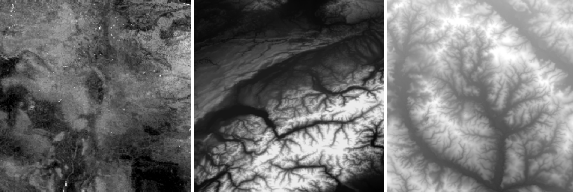
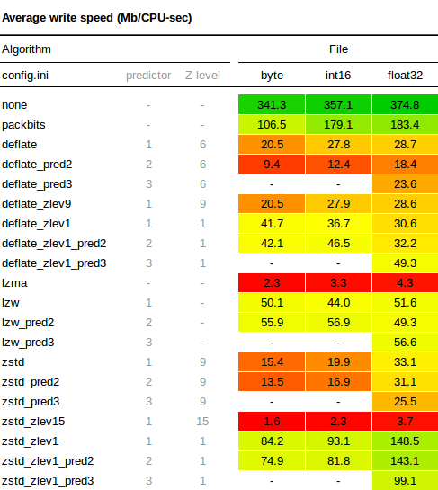
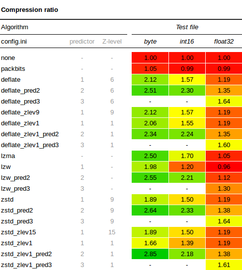
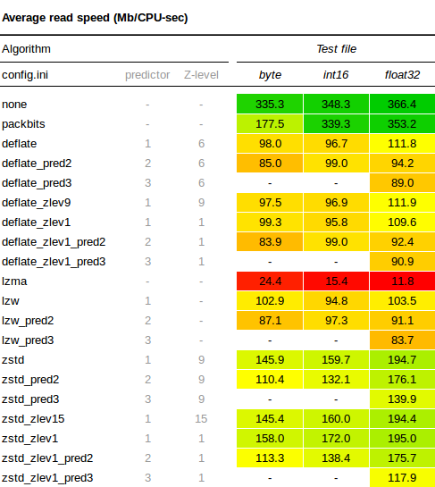
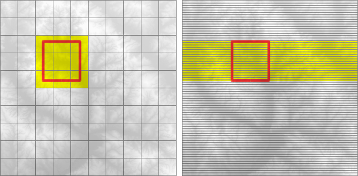
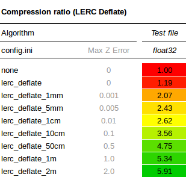

title: Guide to GeoTIFF compression and optimization with GDAL
type: article
slug: geotiff-compression-optimization-guide
tags: [geo, geofolio, gdal, geotiff, compression]
status: published
preview: preview.jpg
date: 2018-08-16

With the fast ZSTD compression (GDAL 2.3 and above) and Limited Error Raster Compression (GDAL 2.4) becoming available in our favourite geospatial toolkit, I thought it would be interesting to run some benchmarks and write a guide on compressing and optimizing GeoTIFF files using the latest versions of GDAL. 

Especially if you're working with GDAL's [virtual file systems](https://www.gdal.org/gdal_virtual_file_systems.html) and [cloud-optimized GeoTIFFs](https://trac.osgeo.org/gdal/wiki/CloudOptimizedGeoTIFF), deciding on the right compression algorithm and creation options can make a significant difference to indicators such as file size, processing time, and the amount of time and bandwidth consumed when accessing geospatial data over a network.  

# What's the plan

We're going to run a benchmark to test compression ratio and read/write speeds for various data types and algorithms with their respective configuration options. 

## Test files

Three test files with commonly used data types have been created for this test: ``byte.tif``, ``int16.tif``, and ``float32.tif``. Each file has been cropped to be around 50Mb each in its uncompressed condition. See the notes and comments section for a download link and more information. Just to give an impression, this is what the Byte, Int16, and float32 images look like zoomed out:

It is important to mention here that these are just test files, and that your results will vary depending on the type of data you're working with. So interpret the results not as the absolute truth, but rather as an indication and a guideline of what the tradeoffs between the different algorithms and configuration options are. Experiment with your own data to find out what works best for you.

## Algorithms and creation options

We are going to test the following compression algorithms: 

   * None
   * PACKBITS
   * Deflate
   * LZW
   * LZMA
   * ZSTD

The Deflate, LZW and ZSTD algorithms support the use of predictors, which is a method of storing only the difference from the previous value instead of the actual value. There are three predictor settings we can test: 
   
   * No predictor (1, default)
   * Horizontal differencing (2)
   * Floating point predition (3)

Predictors work especially well when there is some spatial correlation in the data, and pixels have values which are similar to their neighbours. As the name suggests, the floating point predictor can only be used on floating point data.

The ZSTD and Deflate algorithms support custom compression levels throught the ``ZLEVEL`` and ``ZSTD_LEVEL`` creation options. Compression levels can be lowered to speed up the algorithm at the expense of the compression ratio, or raised to improve the compression ratio at the expense of speed. We'll test the ZSTD and Deflate algorithms with a low, the default, and a high compression level.

All the different tests and corresponding creation options that are used in the benchmark are defined in the [`config.ini`](https://github.com/kokoalberti/geotiff-benchmark/blob/master/config.ini) file.

# Benchmark setup

The benchmark is run inside a Docker container on a temporary AWS ``i3.large`` EC2 instance, just to ensure a clean machine with a local SSD volume and nothing else running in the background. GDAL is built from source in the [``Dockerfile``](https://github.com/kokoalberti/geotiff-benchmark/blob/master/Dockerfile), and version ``2.4.0dev`` is used because it is the first version to fully support LERC and ZSTD compression with the predictor option.

All test commands are run in turn by the main [``gtiff_benchmark.py``](https://github.com/kokoalberti/geotiff-benchmark/blob/master/gtiff_benchmark.py) script, which calls a different [``gdal_translate``](https://www.gdal.org/gdal_translate.html) command using ``perf stat`` for each combination of tests, something like:

    :::sh
    perf stat -x ^ -r 5 gdal_translate \
        -q int16.tif output.tif \
        -co COMPRESS=DEFLATE \
        -co PREDICTOR=2

The ``gdal_translate`` command is repeated by ``perf stat`` with the relevant creation options 5 times. The final results (time, compression ratio, etc) are logged to a CSV file by the main script.

# Benchmark results

## Write speed

The write tests measure the time required to write each of the 50Mb files with the corresponding compression settings. The speed in the table below is relative to original file size, so it is an indication of how many Mb of raw data can be compressed in one second. For example, if the 50Mb file was written in 0.5 seconds, a speed of 100Mb/s is reported below. The results are as follows:

A few observations worth noting:

* The write speeds with compression levels of 1 (for ZSTD and Deflate) are significantly faster than the default levels.
* With default compression Deflate is writes slightly fast than ZSTD, only at the lower compression levels is ZSTD generally faster. 
* LZW is very constant and performs well with default settings, being faster than both ZSTD and Deflate. Only with lower compression levels does Deflate catch up, and ZSTD overtake LZW in terms of write speed.
* Use of a predictor with Deflate seems to reduce the write speed more than with other algorithms.

## Compression ratio

Here is the full results table for the compression ratio tests:

This also yielded some interesting observations:

* Using ``PREDICTOR=2`` always results in a better compression ratio than using the no predictor default. In this case it may be somewhat due to the spatial correlation of values in our DEM and soil map, but I think a lot of geographical data has some sort of spatial correlation, so I wouldn't be surprised to see similar results in many other datasets as well.
* Byte and Int16 generally compress better than Float32 data types. When you're using floating point data, it is worth investigating whether you can convert your data to a Byte or Int16 datatype instead. It will use less space and compresses better. Depending on the data, this can sometimes be done by multiplying your floating point data by a certain factor (10, 100 or 1000), then storing the whole number as a Byte or Int16, and only divide by the chosen factor again when you need the data for visualization or further processing. Also have a look at the LERC section further down in this article.
* The floating point predictor ``PREDICTOR=3`` results in significantly better compression ratios for floating point data. There doesn't seem to be a performance penalty either for writing data with the floating point predictor, so it's a pretty safe bet for any Float32 data.
* When using the right predictor, differences in compression ratio between ZSTD, Deflate, and LZW are not spectacular.

## Read speed

Here is the full results table for the read speed tests:

* ZSTD lives up to its reputation for being speedy, performing better than both LZW and Deflate, which are comparable in terms of decompression speed.
* Using Z-levels in the compression does not seem to influence decompression speeds much.
* Use of predictors seems to make the decompression a little bit slower, but not by much.

# Further considerations

This section dives in to some additional issues and GDAL settings that might have an impact on performance. Refer to the [GeoTIFF File Format](https://www.gdal.org/frmt_gtiff.html) and [config options](https://trac.osgeo.org/gdal/wiki/ConfigOptions) documentation for more information on how they work and how to apply them using the command line tools.

## Tiling

When the creation option ``TILED=YES`` is enabled, data is stored and compressed in blocks (tiled) rather than line by line (stripped). The size of the tiles can be configured using the ``BLOCKXSIZE=n`` and ``BLOCKYSIZE=n`` creation options. Tiling is not much use when you're always reading the entire file or only a single pixel at a time, as respectively all or only one tile or strip will have to be decompressed.

For accessing subsets though, tiling can make a difference. For example, the grids below show an image with 100 equally sized tiles (left) and the same number of strips (right). To read data from the red subset, the yellow area will have to be decompressed. In the tiled image we will have to decompress only 9 tiles, whereas in the stripped image on the right we'll have to decompress around twice as many strips. 

Creating a tiled image may take a little bit longer than one without tiles, so it's best to experiment and check for yourself whether tiling works for you.

## Limited Error Raster Compression (LERC)

LERC is available from GDAL 2.4 onwards, and is designed to obtain a better compression ratio at the expense of the precision of the data. The key feature is that LERC lets the user, using the ``MAX_Z_ERROR`` creation option, define exactly how lossy the algorithm is allowed to be. LERC can be used standalone as ``COMPRESS=LERC`` or in combination with ZSTD or Deflate as ``COMPRESS=LERC_ZSTD`` and  ``COMPRESS=LERC_DEFLATE``.

As a quick experiment I ran the benchmark again on our floating point dataset with ``COMPRESS=LERC_DEFLATE``, gradually increasing the ``MAX_Z_ERROR`` to see the effect on the compression ratio. Remember that in our original results, the best possible compression ratio achieved with Deflate and a floating point predictor was 1.64. The results are interesting to say the least:

If we reduce the precision to within even 1mm of elevation using ``MAX_Z_ERROR=0.001``, the compression ratio already jumps to 2.07, that's a space saving of more than 50%. The ratio increases rapidly as the precision is reduced, and at a precision of 1 meter with ``MAX_Z_ERROR=1.0``, the space saving is above 80% with a compression ratio of 5.3. So, if you're using floating point data, take a minute to think about what precision is required for your particular application. If it's anything above zero, give LERC some thought.

## Overviews

Overviews are duplicate versions of your original data, but resampled to a lower resolution. This is useful when you're rendering or reading zoomed out versions of your data, and there is too much data to be able to calculate these overviews on the fly. 

The easiest way to add overviews to a GeoTIFF is to use the [``gdaladdo``](https://www.gdal.org/gdaladdo.html) utility. Because the overview are in fact datasets as well, they can also be compressed with various algorithms and predictors, much in the same way as your original dataset. In addition to this, you need to decide what resampling algorithm to use in order to convert many high resolution values to a single low resolution value for use in the overview. Here too there are different methods: fast and imprecise such as nearest neighbour, and more complicated ones such as average or cubicspline. Check the [gdaladdo documentation](https://www.gdal.org/gdaladdo.html) and experiment.

## NUM_THREADS

You can set ``NUM_THREADS=ALL_CPUS`` creation option to enable multi-threaded compression for slow algorithms like Deflate. I gained about a 30% performance improvement when compressing the ``int16.tif`` file with ``COMPRESS=DEFLATE`` and ``NUM_THREADS=ALL_CPUS``. The ``NUM_THREADS`` option only works on compression, so there is no effect on read times.

## GDAL_DISABLE_READDIR_ON_OPEN

When GDAL opens a file from a local directory or network, it will automatically try and establish a list of other files present in that location. This can result in a delay when accessing files over a network, or in a local directory with more than a few hundred other files. The behaviour can be prevented by setting the configuration option [``GDAL_DISABLE_READDIR_ON_OPEN``](https://trac.osgeo.org/gdal/wiki/ConfigOptions) to ``TRUE``.

## GDAL_CACHEMAX

The [``GDAL_CACHEMAX``](https://trac.osgeo.org/gdal/wiki/ConfigOptions) configuration option can be used to set the raster block size cache. In some quick tests I did not see any performance improvements in read or write speeds. Perhaps this was because the default values are already large enough in later versions of GDAL, or that I was not working with extremely large files where caching would be required. Others reported [much faster read times](http://www.digital-geography.com/geotiff-compression-comparison/) on large files, so it may be worth experimenting with. You can set it to 1000MB using ``--config GDAL_CACHEMAX 1000`` in your GDAL command.

## Compressing Imagery

While compressing imagery is outside of the scope of this article, I wanted to mention it nevertheless to be complete. When the data you're trying to compress consists of imagery (aerial photographs, true-color satellite images, or colored maps) you can use lossy algorithms such as JPEG to obtain a much improved compression ratio. A lossy algorithm such as JPEG is not suitable though for compressing data where the precision is important, which is why I skipped it here in this benchmark. If you're compressing imagery, have a look at the article by Paul Ramsey for some results and best practices on [compressing GeoTIFFs with JPEG compression](http://blog.cleverelephant.ca/2015/02/geotiff-compression-for-dummies.html).

# Conclusions

I hope this article has given a thorough overview of how the different compression algorithms in the GeoTIFF drivers perform, and what configuration options can be used to squeeze some extra performance from your GeoTIFF files. 

Most importantly, keep experimenting and use the techniques in this article to find out what works best for your data and access methods. Be aware of the type of data you have, and use the appropriate predictors and z-levels for a quick performance boost.

As for the future, the additions of ZSTD (fast) and LERC (magic) in the latest versions of GDAL are really promising, I can't wait to put them to the test in some real world scenarios.

<h2 class='notes-and-comments'>Notes and comments</h2>

Thanks for reading! While there is no comment functionality on this website, I do appreciate any feedback, questions, improvements, and other ideas about this article. Feel free to contact me directly via e-mail at <a href="mailto:koko@geofolio.org">koko@geofolio.org</a>.

The test files are an extract from <a href="http://soilgrids.org">soilgrids.org</a> (Byte), a DEM extracted from an SRTM tile (Int16), and a hi-res DEM from the USGS National Elevation Dataset (Float32). The test files can be downloaded from <a href="https://s3.us-east-2.amazonaws.com/geotiff-benchmark-sample-files/geotiff_sample_files.tar.gz">here</a>.

There are a few other blog posts on this subject that you can have a look at for additional information:

<ul class="notes-and-comments">
<li><a href="http://openterrain.tumblr.com/post/117553678231/gdal-compression-options-against-ned-data">GDAL compression options against NED data</a></li>
<li><a href="http://www.digital-geography.com/geotiff-compression-comparison/">GeoTIFF compression comparison</a></li>
<li><a href="http://blog.cleverelephant.ca/2015/02/geotiff-compression-for-dummies.html">GeoTIFF compression for dummies</a></li>
</ul>

The code for the benchmarks is available at: <a href="https://www.github.com/kokoalberti/geotiff-benchmark">https://www.github.com/kokoalberti/geotiff-benchmark</a>

