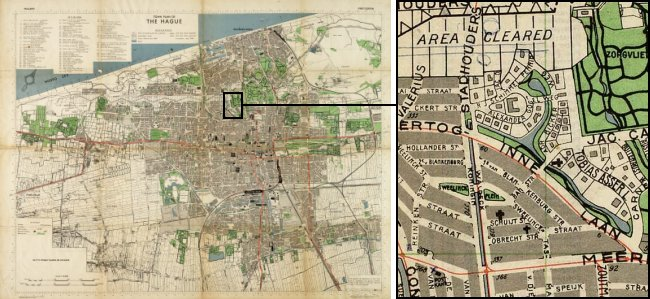
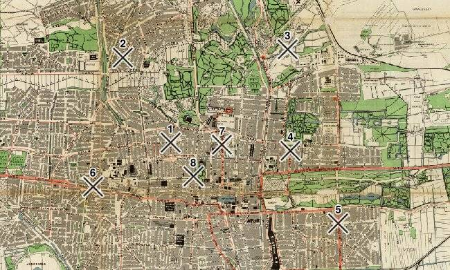
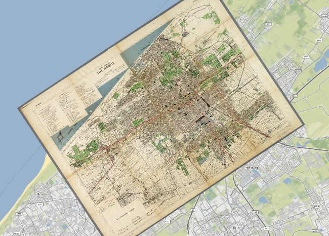
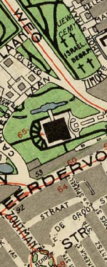
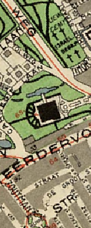
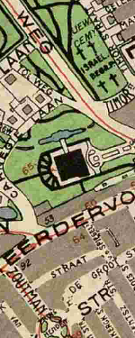

title: Georeferencing and digitizing old maps with GDAL
type: article
slug: georeferencing-and-digitizing-old-maps-with-gdal
tags: [geo, gdal, georeferencing]
status: published
date: 2018-08-23

While cleaning up some USB drives I had lying around I ran into some scanned images of old wartime maps of my home town The Hague. I quite like the cartographic style of them, and decided to digitize the maps using GDAL and turn it into a web map. This article explains how to do that, compares some of the different interpolation options, and shows how to make web tiles out of the resulting images.

The original scanned image is 7000 by 5263 pixels, and it shows quite a bit of detail in a vintage high-contrast cartographic style that you see more often in wartime maps: 

The original image does not have any georeferencing information, it's just a picture and we have no idea how it fits to a place on Earth, so we need to add that first to be able to work with it using GDAL or other GIS software.

# Georeferencing the image

The basic idea behind georeferencing an image is to define the relationship between the x and y coordinates (pixels) of the image, and latitude and longitude coordinates of where those pixels really are on Earth. Each of these matches is called a ground control point (GCP), and you need a bunch of them spread out over the image to be able to make a good translation between the image coordinates and coordinates on Earth.

I created eight GCPs by looking up the coordinates of various road intersections and landmarks in the city, and then matching them to pixel x and y coordinates in the image:

<table class="table" style="border:1px solid #ccc;width:500px;margin:auto;font-size:0.8em;">
<tr><td style="width:15%">GCP</td><td style="width:24%">Longitude</td><td style="width:24%">Latitude</td><td style="width:24%">Image X</td><td style="width:24%">Image Y</td></tr>
<tr><td>1</td><td>4.29460</td><td>52.08246</td><td>4203.7</td><td>-2347.0</td></tr>
<tr><td>2</td><td>4.27438</td><td>52.08875</td><td>3830.5</td><td>-1673.9</td></tr>
<tr><td>3</td><td>4.30543</td><td>52.10252</td><td>5122.7</td><td>-1611.8</td></tr>
<tr><td>4</td><td>4.31844</td><td>52.09088</td><td>5146.7</td><td>-2409.3</td></tr>
<tr><td>5</td><td>4.33713</td><td>52.08625</td><td>5522.5</td><td>-2981.5</td></tr>
<tr><td>6</td><td>4.28486</td><td>52.07098</td><td>3593.9</td><td>-2691.5</td></tr>
<tr><td>7</td><td>4.30491</td><td>52.08618</td><td>4609.9</td><td>-2362.8</td></tr>
<tr><td>8</td><td>4.30329</td><td>52.08022</td><td>4383.0</td><td>-2612.1</td></tr>
</table>

Instead of doing this by hand, QGIS also has a georeferencing plugin which has a nice user interface which you can use to do this. It's probably best to [read their tutorial](https://www.qgistutorials.com/en/docs/georeferencing_basics.html) rather than explaining everything again here. 

Now that we have a set of GCPs we can use the ``gdal_translate`` command to merge our plain map image and the GCPs into a new GeoTIFF file. Each of the GCPs is supplied using the ``-gcp`` option:

    :::sh
    $ gdal_translate \
        -gcp 4203.71 2347 4.2946 52.0825 \
        -gcp 3830.5 1673.93 4.27438 52.0888 \
        -gcp 5122.71 1611.8 4.30542 52.1025 \
        -gcp 5146.66 2409.35 4.31844 52.0909 \
        -gcp 5522.45 2981.46 4.33713 52.0862 \
        -gcp 3593.85 2691.52 4.28486 52.071 \
        -gcp 4609.93 2362.75 4.30491 52.0862 \
        -gcp 4382.98 2612.13 4.30328 52.0802 \
        -of GTiff \
        map-original.jpg \
        map-with-gcps.tif
    Input file size is 7200, 5495
    0...10...20...30...40...50...60...70...80...90...100 - done.
    $

We should be able to see the GCPs now in our new file with ``gdalinfo``:

    ::::sh
    $ gdalinfo map-with-gcps.tif
    
    (...)

    Size is 7200, 5495
    GCP Projection = 
    GCP[  0]: Id=1, Info=
              (4203.71,2347) -> (4.2946,52.0825,0)
    GCP[  1]: Id=2, Info=
              (3830.5,1673.93) -> (4.27438,52.0888,0)
    GCP[  2]: Id=3, Info=
              (5122.71,1611.8) -> (4.30542,52.1025,0)
    GCP[  3]: Id=4, Info=
              (5146.66,2409.35) -> (4.31844,52.0909,0)
    GCP[  4]: Id=5, Info=
              (5522.45,2981.46) -> (4.33713,52.0862,0)
    GCP[  5]: Id=6, Info=
              (3593.85,2691.52) -> (4.28486,52.071,0)
    GCP[  6]: Id=7, Info=
              (4609.93,2362.75) -> (4.30491,52.0862,0)
    GCP[  7]: Id=8, Info=
              (4382.98,2612.13) -> (4.30328,52.0802,0)

    (...)
    
    $

# Reprojecting the image

Our ``map-with-gcps.tif`` now contains the GCPs, but it's still the same size as our original image and rotated in a funny way. To show it as a web map, we want the north to be up, and it is better to have it in a commonly used spatial reference system so we can use the file in other GIS programmes and web mapping applications as well. 

Therefore we'll use ``gdalwarp`` to reproject the image. The ``-tps`` option forces the use of thin plate spline transformation based on the GCPs we added to the image in the previous step:

    :::sh
    gdalwarp \
        -tps \
        -r bilinear \
        -s_srs "EPSG:4326" \
        -t_srs "EPSG:3857" \
        -overwrite \
        -tr 2.0 -2.0 \
        map-with-gcps.tif \
        map-reprojected.tif

The ``-s_srs`` is the spatial reference system that our GCP coordinates were in, and the ``-t_srs`` option defines the spatial reference system that we want our output map to be in. In our case want it in pseudo-mercator, which has an EPSG code of 3857. After running the command, the ``map-reprojected.tif`` file is now properly georeferenced, as we can see when we load it in QGIS on top of another layer:

## Tweaking the output resolution and resampling method

The ``-tr`` option is important as it defines the resolution of the output map. The units have to be the same as in the target coordinate system defined in ``-t_srs``, which in our case is meters. Different target resolutions will result in different qualities of the reprojected map, for example:

<table style="widht:100%;margin:auto;font-size:0.6em;text-align:center;">
<tr><td><code>-tr 20 20</code></td><td><code>-tr 10 10</code></td><td><code>-tr 5 5</code></td><td><code>-tr 5 5</code></td><td><code>-tr 1 1</code></td></tr>
<tr>
	<td style="width:20%"></td>
	<td style="width:20%"></td>
	<td style="width:20%"></td>
	<td style="width:20%"></td>
	<td style="width:20%"></td>
</tr>
</table>

Pick a sensible target resolution depending on the scale of your map. A resolution of 1m on a map of a very large area is going to create a huge file and take a very long time! Keep in mind that every time you half the cell size your file will become four times bigger, and vice versa.

The resampling method defined in the ``-r`` option also affects image quality. It's best to experiment a bit to see what works best for your map and target resolution. Nearest neighbour is usually fast but somewhat imprecise, and the others a bit more blurry. Here are some tests on our map with a 5 meter resolution:

<table style="width:100%;margin:auto;font-size:0.6em;text-align:center;">
<tr><td><code>-r near</code></td><td><code>-r bilinear</code></td><td><code>-r cubic</code></td><td><code>-r cubicspline</code></td><td><code>-r lanczos</code></td></tr>
<tr>
	<td style="width:20%"></td>
	<td style="width:20%"></td>
	<td style="width:20%"></td>
	<td style="width:20%"></td>
	<td style="width:20%"></td>
</tr>
</table>

I wanted the map to look crisp and legible even at the highest zoom levels, so after some experimenting I've chosen to use a target resolution of 2 meters with bilinear resampling. At a resolution of 2 meters even the small street names still look sharp, and the bilinear resampling seems to be a decent middle ground between the blurry and more gritty methods.

## Compression

Unfortunately, because our image now contains uncompressed data at a 2 meter resolution, the file size has become quite large. The output file is now 14866 by 14044 pixels and around 600Mb. Using JPEG compression we can reduce the final map to a more managable file size while still preserving most of the image quality. By adding the following creation options to the previous ``gdalwarp`` command we add JPEG compression to the same processing step:

    :::sh
    -co COMPRESS=JPEG
    -co JPEG_QUALITY=50
    -co PHOTOMETRIC=YCBCR

Setting the ``PHOTOMETRIC=YCBCR`` creation option makes GDAL store the image in YCBCR color space instead of RGB, and according to the documentation it can make the image size 2 to 3 times smaller when used together with JPEG compression. Additionally, the ``JPEG_QUALITY`` is a value from 1 to 100 and lets you trade some image quality for compression ratio. I tested a few different options to see the effects:

<table style="width:100%;margin:auto;font-size:0.6em;text-align:center;">
<tr><td><code>-co JPEG_QUALITY=10</code></td><td><code>-co JPEG_QUALITY=25</code></td><td><code>-co JPEG_QUALITY=50</code></td><td><code>-co JPEG_QUALITY=75</code></td><td><code>-co JPEG_QUALITY=100</code></td></tr>
<tr>
	<td style="width:20%"></td>
	<td style="width:20%"></td>
	<td style="width:20%"></td>
	<td style="width:20%"></td>
	<td style="width:20%"></td>
</tr>
<tr><td><code>11Mb</code></td><td><code>18Mb</code></td><td><code>26Mb</code></td><td><code>36Mb</code></td><td><code>141Mb</code></td></tr>
</table>

The effect on image quality is minimal, whereas the reduction in file size is rather significant. In other parts of the image I did notice some artifacts at the lower levels, so I decided to use ``JPEG_QUALITY=50`` for the final map.

## Tiling

One more optimization we can do to our image in this processing step is to add tiling to it. Tiling helps to speed up access to the file, and can be added to the ``gdalwarp`` command with:

    :::sh
    -co TILED=YES

Summing it all up, our final ``gdalwarp`` command is now:

    :::sh
    gdalwarp \
        -r bilinear \
        -s_srs "EPSG:4326" \
        -t_srs "EPSG:3857" \
        -overwrite \
        -tps \
        -tr 2 -2 \
        -co COMPRESS=JPEG \
        -co PHOTOMETRIC=YCBCR \
        -co JPEG_QUALITY=10 \
        -co TILED=YES \
        map-with-gcps.tif \
        map-reprojected.tif

## Overviews

The last step is to add overviews, which are low resolution versions of the original image that can be used when rendering zoomed out versions of the map. In such a case the overviews will be loaded rather than having to calculate a zoomed out version of the map on the fly. Overviews can be added using the ``gdaladdo`` utility. We'll create five overview levels (2, 4, 8, 16, and 32) and specify the same compression parameters for the overview images as we used for the main image:

    :::sh
    gdaladdo \
        --config COMPRESS_OVERVIEW JPEG \
        --config PHOTOMETRIC_OVERVIEW YCBCR \
        --config JPEG_QUALITY_OVERVIEW 50 \
        -r average \
        map-reprojected.tif 2 4 8 16 32

The overviews will be added internally to the GeoTIFF file, so no new files will be created. Our final optimized file size is now a very reasonable 19Mb.

# Making web tiles

Our georeferenced file is pretty much finished at this point and can be used efficiently in QGIS, Mapserver, or for any other type of processing with GDAL. 

While we could serve the map using Mapserver, I don't want to have to maintain a Mapserver instance somewhere, so instead prefer to make static tiles out of the file and host the tiles on Amazon S3. For this we need to chop the file into small tiles which can then be loaded in a map viewer like Leaflet. There is a GDAL utility called ``gdal2tiles.py`` that we can use, but that doesn't generate JPEG tiles and it's a little  difficult to tell what zoom level of tiles we should use. Instead, we can write a quick Python script ourselves to create the tiles in JPEG format and estimate some sensible defaults for the zoom levels we need to generate:

    :::python
    """
    Usage: mktiles.py <filename.tif>
    
    Quick and dirty program to make JPEG map tiles from an image, automatically
    matching the image size to most appropriate tile zoom levels.
    
    File must be in pseudomercator projection already.
    """
    import os
    import sys
    import math
    from osgeo import gdal

    # Mercantile can be installed with 'pip install mercantile'
    import mercantile
    
    # Open the file and get geotransform information
    ds = gdal.Open(sys.argv[0])
    if ds is None:
        print("Could not open file!")
        sys.exit(1)
    gt = ds.GetGeoTransform()
    
    # Estimate a maximum and minimum z level to fit the image
    z_max = math.floor(math.log(40075016.0, gt[1]) - 8) - 1
    z_min = z_max - math.ceil(math.log(max(ds.RasterXSize, ds.RasterYSize) / 256, 2))
    
    # Get the geographic coordinates of the file's left top and right bottom 
    lt = mercantile.lnglat(gt[0], gt[3])
    rb = mercantile.lnglat(gt[0] + (ds.RasterXSize * gt[1]), 
                           gt[3] + (ds.RasterYSize * gt[5]))
    
    # Use the coordinates and z levels to create an iterator listing all the tiles
    # we're going to create. 
    tiles = mercantile.tiles(lt.lng, rb.lat, rb.lng, lt.lat, range(z_min, z_max + 1))
    
    # Loop through all the the tiles, and render each one using gdal.Translate()
    for tile in tiles:

        # Create the filename and directory for the tile
        filename = "./tiles/{}/{}/{}.jpg".format(tile.z, tile.x, tile.y)
        print("Creating tile {}".format(filename))
        try: os.makedirs(os.path.dirname(filename))
        except: pass

        # Convert tile bounds to a projwin for passing to gdal.Translate()
        (left, bottom, right, top) = list(mercantile.xy_bounds(tile))
        projwin = (left, top, right, bottom)

        # Call gdal.Translate()
        gdal.Translate(filename, 
                       ds, 
                       projWin=projwin, 
                       width=256, 
                       height=256, 
                       format='JPEG', 
                       creationOptions=['QUALITY=75'])

        # Remove the automatically create xml file 
        os.remove(filename+'.aux.xml')

<h2 class='notes-and-comments'>Notes and comments</h2>

Thanks for reading! While there is no comment functionality on this website, I do appreciate any feedback, questions, improvements, and other ideas about this article. Feel free to contact me directly via e-mail at <a href="mailto:koko@geofolio.org">koko@geofolio.org</a>.

