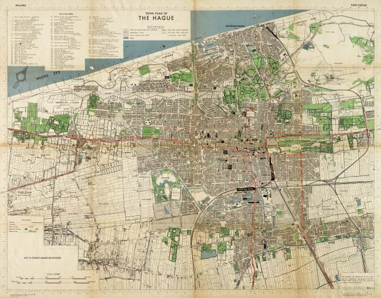
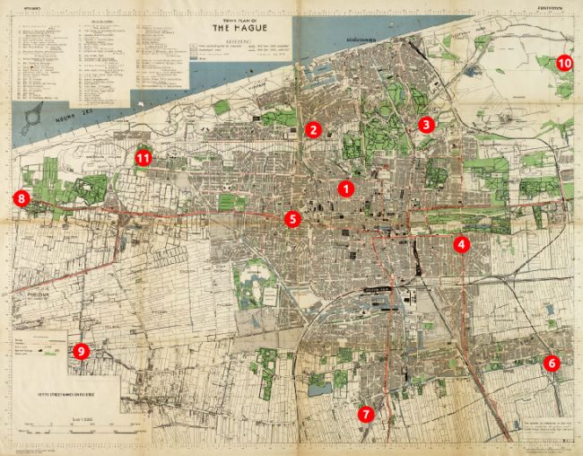
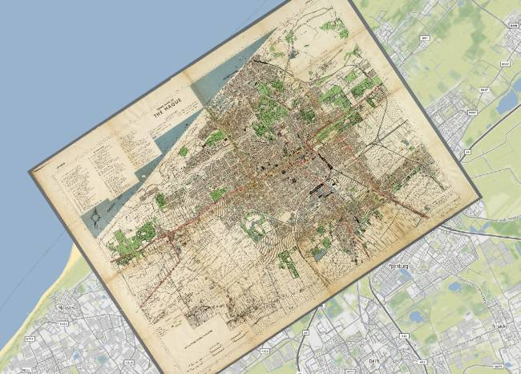
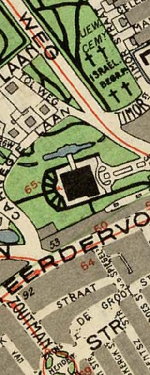
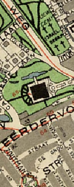
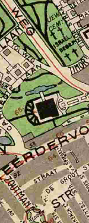

title: Georeferencing and digitizing old maps with GDAL
type: article
slug: georeferencing-and-digitizing-old-maps-with-gdal
tags: [geo, gdal, georeferencing]
status: published
preview: preview.jpg
date: 2018-09-12

While cleaning up some old USB drives I found several scanned images of wartime maps of my home town The Hague. I quite like the cartographic style and decided to digitize the maps using GDAL and turn them into a web map. This article explains how to do that, compares some of the different GDAL options, and shows how to make web tiles and a map viewer using Leaflet. 

The end result is something like this, past (left) and present (right) in a continuous interactive map:

<iframe src="https://s3.eu-central-1.amazonaws.com/old-maps/the-hague-1944/index.html?noscrollzoom"
             style="width:100%;height:500px;border:none;position:absolute;left:0px;margin-top:20px;"></iframe>

&nbsp;

The original scanned image is 7000 by 5263 pixels, and it shows great details in a vintage high-contrast cartographic style that you see more often in wartime maps: 

The original image does not have any georeferencing information, it's just a picture and we have no idea how it fits to a place on Earth, so we need to add that first to be able to work with it using GDAL or other GIS software.

# Georeferencing the image

The basic idea behind georeferencing an image is to define the relationship between the X and Y coordinates (essentially pixels) of the image, and latitude and longitude coordinates of where those pixels really are on Earth. Each of these matches is called a ground control point (GCP), and you need a bunch of them spread out over the image to be able to make a good transformation between the image coordinates and coordinates on Earth.

I created eleven GCPs by looking up the coordinates of various recognizable road intersections and landmarks in the city and surrounding areas, and then matching them to pixel X and Y coordinates in the image. Try and capture points spread out and in the corners of the original image, as this will improve the accuracy of the georeferencing. Here is where my GCPs are located:

<table class="table" style="border:1px solid #ccc;width:650px;margin:auto;font-size:0.8em;font-family:monospace;text-align:center;">
<tr style="background-color:#f5f5f5;width:20%;font-weight:600;"><td>GCP</td><td style="width:20%">Pixel X</td><td style="width:20%">Pixel Y</td><td style="width:20%">Longitude</td><td style="width:20%">Latitude</td></tr>

<tr><td>1</td><td>4203.7</td><td>2347.0</td><td>4.2946</td><td>52.0825</td></tr>
<tr><td>2</td><td>3830.5</td><td>1673.9</td><td>4.2744</td><td>52.0888</td></tr>
<tr><td>3</td><td>5122.7</td><td>1611.8</td><td>4.3054</td><td>52.1025</td></tr>
<tr><td>4</td><td>5522.5</td><td>2981.5</td><td>4.3371</td><td>52.0862</td></tr>
<tr><td>5</td><td>3593.9</td><td>2691.5</td><td>4.2849</td><td>52.0710</td></tr>
<tr><td>6</td><td>6560.4</td><td>4341.7</td><td>4.3844</td><td>52.0761</td></tr>
<tr><td>7</td><td>4432.0</td><td>4929.8</td><td>4.3406</td><td>52.0464</td></tr>
<tr><td>8</td><td>486.8</td><td>2458.7</td><td>4.2042</td><td>52.0447</td></tr>
<tr><td>9</td><td>1171.9</td><td>4210.5</td><td>4.2483</td><td>52.0252</td></tr>
<tr><td>10</td><td>6704.4</td><td>907.2</td><td>4.3332</td><td>52.1289</td></tr>
<tr><td>11</td><td>1880.0</td><td>1993.3</td><td>4.2314</td><td>52.0650</td></tr>

<!--

<tr><td></td><td>4.29460</td><td>52.08246</td><td>4203.7</td><td>-2347.0</td></tr>
<tr><td></td><td>4.27438</td><td>52.08875</td><td>3830.5</td><td>-1673.9</td></tr>
<tr><td></td><td>4.30543</td><td>52.10252</td><td>5122.7</td><td>-1611.8</td></tr>
<tr><td></td><td>4.31844</td><td>52.09088</td><td>5146.7</td><td>-2409.3</td></tr>
<tr><td></td><td>4.33713</td><td>52.08625</td><td>5522.5</td><td>-2981.5</td></tr>
<tr><td></td><td>4.28486</td><td>52.07098</td><td>3593.9</td><td>-2691.5</td></tr>
<tr><td></td><td>4.30491</td><td>52.08618</td><td>4609.9</td><td>-2362.8</td></tr>
<tr><td></td><td>4.30329</td><td>52.08022</td><td>4383.0</td><td>-2612.1</td></tr>-->
</table>

Because this is not fun to do by hand, QGIS also has a handy georeferencing plugin which will let you create such a table using a graphical user interface. Check out [the georeferencing tutorial](https://www.qgistutorials.com/en/docs/georeferencing_basics.html) on how to enable the plugin and do the georeferencing in QGIS. I just use the plugin for making the table and then continue in GDAL so I can be picky about how the other settings are applied.

Now that we have a set of GCPs we can use the ``gdal_translate`` command to merge our original image with the GCPs into a new GeoTIFF file. Each of the GCPs is supplied using repeated ``-gcp`` options, with the parameters in the same order as the table above:

    :::console
    $ gdal_translate \
        -gcp 4203.7 2347.0 4.2946 52.0825 \
        -gcp 3830.5 1673.9 4.2744 52.0888 \
        -gcp 5122.7 1611.8 4.3054 52.1025 \
        -gcp 5522.5 2981.5 4.3371 52.0862 \
        -gcp 3593.9 2691.5 4.2849 52.0710 \
        -gcp 6560.4 4341.7 4.3844 52.0761 \
        -gcp 4432.0 4929.8 4.3406 52.0464 \
        -gcp 486.8 2458.7 4.2042 52.0447 \
        -gcp 1171.9 4210.5 4.2483 52.0252 \
        -gcp 6704.4 907.2 4.3332 52.1289 \
        -gcp 1880.0 1993.3 4.2314 52.0650 \
        -of GTiff \
        map-original.jpg \
        map-with-gcps.tif
    Input file size is 7200, 5495
    0...10...20...30...40...50...60...70...80...90...100 - done.
    $

We should be able to see the GCPs now in our new file with ``gdalinfo``:

    ::::console
    $ gdalinfo map-with-gcps.tif
    
    (...)

    Size is 7200, 5495
    GCP Projection = 
    GCP[  0]: Id=1, Info=
              (4203.71,2347) -> (4.2946,52.0825,0)
    GCP[  1]: Id=2, Info=
              (3830.5,1673.93) -> (4.27438,52.0888,0)
    GCP[  2]: Id=3, Info=
              (5122.71,1611.8) -> (4.30542,52.1025,0)
    GCP[  3]: Id=4, Info=
              (5146.66,2409.35) -> (4.31844,52.0909,0)
    GCP[  4]: Id=5, Info=
              (5522.45,2981.46) -> (4.33713,52.0862,0)
    GCP[  5]: Id=6, Info=
              (3593.85,2691.52) -> (4.28486,52.071,0)
    GCP[  6]: Id=7, Info=
              (4609.93,2362.75) -> (4.30491,52.0862,0)
    GCP[  7]: Id=8, Info=
              (4382.98,2612.13) -> (4.30328,52.0802,0)

    (...)
    
    $

# Reprojecting the image

Our ``map-with-gcps.tif`` now contains embedded GCPs, but it's still rotated and has the same proportions as our original image. It is also not reprojected into a commonly used spatial reference system, which allows you to easily use the file in other GIS programs and toolkits.

Therefore we'll use ``gdalwarp`` to reproject or warp the image into a pseudo-mercator projection commonly used for web maps. The ``-tps`` option forces the use of thin plate spline transformation based on the GCPs we've added to the image in the previous step:

    :::console
    gdalwarp \
        -tps \
        -r bilinear \
        -s_srs "EPSG:4326" \
        -t_srs "EPSG:3857" \
        -overwrite \
        -tr 2.0 -2.0 \
        map-with-gcps.tif \
        map-reprojected.tif

The ``-s_srs`` is the spatial reference system that our GCP coordinates were in, and the ``-t_srs`` option defines the spatial reference system that we want our output map to be in. In our case want it in pseudo-mercator, which has an EPSG code of 3857. After running the command, the ``map-reprojected.tif`` file is now properly georeferenced, as we can see when we load it in QGIS on top of another layer:

## Tweaking the output resolution and resampling method

The ``-tr`` option of the ``gdalwarp`` command is important as it defines the resolution of the output map. The units have to be the same as in the target coordinate system defined in ``-t_srs``, which in our case is meters. Different target resolutions will result in different qualities of the reprojected map, for example:

<table style="widht:100%;margin:auto;font-size:0.6em;text-align:center;">
<tr><td><code>-tr 20 20</code></td><td><code>-tr 10 10</code></td><td><code>-tr 5 5</code></td><td><code>-tr 5 5</code></td><td><code>-tr 1 1</code></td></tr>
<tr>
	<td style="width:20%"></td>
	<td style="width:20%"></td>
	<td style="width:20%"></td>
	<td style="width:20%"></td>
	<td style="width:20%"></td>
</tr>
</table>

Pick a sensible target resolution depending on the scale of your map. A resolution of 1m on a map of a very large area is going to create a huge file and take a very long time! Keep in mind that every time you half the cell size your file will become four times bigger, and vice versa.

The resampling method defined in the ``-r`` option also affects image quality. It's best to experiment a bit to see what works best for your map and target resolution. Nearest neighbour is usually fast but a bit grainy or gritty, and the others a bit more blurry. Here are some tests of the resampling methods on our map with a 5 meter resolution:

<table style="width:100%;margin:auto;font-size:0.6em;text-align:center;">
<tr><td><code>-r near</code></td><td><code>-r bilinear</code></td><td><code>-r cubic</code></td><td><code>-r cubicspline</code></td><td><code>-r lanczos</code></td></tr>
<tr>
	<td style="width:20%"></td>
	<td style="width:20%"></td>
	<td style="width:20%"></td>
	<td style="width:20%"></td>
	<td style="width:20%"></td>
</tr>
</table>

I wanted the map to look crisp and legible even at the highest zoom levels, so after some experimenting I've chosen to use a target resolution of 2 meters with bilinear resampling. At a resolution of 2 meters even the small street names still look sharp, and the bilinear resampling seems to be a decent middle ground between the blurry and more gritty methods.

## Compression

Because our image now contains uncompressed data at a 2 meter resolution, the file size has become quite large. The output file is now nearly 15000 by 14000 pixels and around 600Mb. Using JPEG compression we can reduce the final map to a more managable file size while still preserving the quality of the image. By adding the following creation options to the ``gdalwarp`` command we add JPEG compression into the same processing step:

    :::console
    -co COMPRESS=JPEG
    -co JPEG_QUALITY=50
    -co PHOTOMETRIC=YCBCR

Setting the ``PHOTOMETRIC=YCBCR`` creation option makes GDAL store the image in YCBCR color space instead of RGB, which can make the image size 2 to 3 times smaller than when an RGB color space is used. Additionally, the ``JPEG_QUALITY`` is a value from 1 to 100 and lets you trade some image quality for compression ratio. I tested a few different ``JPEG_QUALITY`` options to see the effects:

<table style="width:100%;margin:auto;font-size:0.6em;text-align:center;">
<tr><td><code>-co JPEG_QUALITY=10</code></td><td><code>-co JPEG_QUALITY=25</code></td><td><code>-co JPEG_QUALITY=50</code></td><td><code>-co JPEG_QUALITY=75</code></td><td><code>-co JPEG_QUALITY=100</code></td></tr>
<tr>
	<td style="width:20%"></td>
	<td style="width:20%"></td>
	<td style="width:20%"></td>
	<td style="width:20%"></td>
	<td style="width:20%"></td>
</tr>
<tr><td><code>11Mb</code></td><td><code>18Mb</code></td><td><code>26Mb</code></td><td><code>36Mb</code></td><td><code>141Mb</code></td></tr>
</table>

The effect on image quality is not obvious, whereas the reduction in file size is rather significant. In other parts of the image I did notice some artifacts at the lower levels, so I decided to use ``JPEG_QUALITY=50`` for the final map. The reason for the minimal effect of the compression could be that the resolution is quite high, and even the samples above are zoomed out a little bit already.

## Tiling

One more optimization we can do to our image in this processing step is to add tiling to it. Enabling tiling will store the data in tiles (square blocks) rather than strips, which helps to speed up access to the file. Tiling can be added to the ``gdalwarp`` command with:

    :::console
    -co TILED=YES

## The final warp

Summing it all up, our final ``gdalwarp`` command creates a reprojected map of 14753 x 13814 pixels which is around 13Mb in size:

    :::console
    $ gdalwarp \
        -r bilinear \
        -s_srs "EPSG:4326" \
        -t_srs "EPSG:3857" \
        -overwrite \
        -tps \
        -tr 2 -2 \
        -co COMPRESS=JPEG \
        -co PHOTOMETRIC=YCBCR \
        -co JPEG_QUALITY=50 \
        -co TILED=YES \
        map-with-gcps.tif \
        map-reprojected.tif
    Creating output file that is 14753P x 13814L.
    Processing input file map-with-gcps.tif.
    0...10...20...30...40...50...60...70...80...90...100 - done.
    $

## Overviews

To finish off our reprojected file we should add overviews as well, which are low resolution versions of the original image that can be used when rendering zoomed out parts (such as tiles at lower zoom levels) of the map. In these cases a zoomed out image will be rendered from the appropriate overview rather than calculating a zoomed out version of the original image on the fly. 

Overviews can be added using the ``gdaladdo`` utility. We'll create five overview levels (2, 4, 8, 16, and 32) and specify the similar compression parameters for the overview images as we used for the main image:

    :::console
    $ gdaladdo \
        --config COMPRESS_OVERVIEW JPEG \
        --config PHOTOMETRIC_OVERVIEW YCBCR \
        --config JPEG_QUALITY_OVERVIEW 50 \
        -r average \
        map-reprojected.tif 2 4 8 16 32
    0...10...20...30...40...50...60...70...80...90...100 - done.
    $

The overviews will be added internally to the GeoTIFF file, so no new files will be created. Our final optimized file size is now a very reasonable 19Mb.

# Making web tiles

Our georeferenced file is pretty much finished at this point and can be used efficiently in QGIS, Mapserver, or for any other type of processing with GDAL. 

To make a web map, we could serve the file as is using Mapserver, but I prefer to make static tiles from the file and host the tiles on Amazon S3. That way I can just upload them there and they'll always work without having to keep any other services up and running. 

For this to work we need to chop the file into small tiles which can then be loaded in a map viewer like Leaflet. There is a GDAL utility called [``gdal2tiles.py``](https://www.gdal.org/gdal2tiles.html), but that doesn't generate JPEG tiles (only PNG tiles, which can get quite large for imagery) and it's a little difficult to tell what zoom level of tiles we should use to match the extent and resolution of our file. 

Because there are some nice Python modules (for example [mercantile](https://github.com/mapbox/mercantile) and [tilematrix](https://github.com/ungarj/tilematrix])) to help us with calculating tile extents and zoom levels it's not too difficult to write a Python script ourselves which creates the tiles in JPEG format and estimates some sensible defaults for the zoom levels that we'll need:

    :::python
    # -*- coding: utf-8 -*-
    """
    Usage: mktiles.py <filename.tif>

    Simple script to make a bunch of map tiles from a GeoTIFF file in pseudomercator 
    projection.
    """

    # Imports
    import os
    import sys
    import argparse
    import math
    import click
    import mercantile
    from osgeo import gdal

    # Parse the command-line arguments
    parser = argparse.ArgumentParser(description='mktiles.py')
    parser.add_argument('input_file', type=str, help='Input file')
    args = parser.parse_args()

    # Open the file and get geotransform information
    ds = gdal.Open(args.input_file)
    if ds is None:
        print("Could not open file!")
        sys.exit(1)
    gt = ds.GetGeoTransform()

    # Estimate a maximum and minimum z level to fit the image, and show some 
    # prompts with defaults that the use can override
    z_max_default = int(math.floor(math.log(40075016.0, gt[1]) - 8) - 1)
    z_max = click.prompt("Maximum Z level", default=z_max_default, type=int)

    z_min_default = int(z_max - math.ceil(math.log(max(ds.RasterXSize, 
                                                       ds.RasterYSize) / 256, 2)))
    z_min = click.prompt("Minimum Z level", default=z_min_default, type=int)

    # Get the geographic coordinates of the file's left top and right bottom 
    lt = mercantile.lnglat(gt[0], gt[3])
    rb = mercantile.lnglat(gt[0] + (ds.RasterXSize * gt[1]), 
                           gt[3] + (ds.RasterYSize * gt[5]))

    # Use the coordinates and z levels we create a list of tiles to generate
    tiles = list(mercantile.tiles(lt.lng, rb.lat, rb.lng, lt.lat, 
                                  range(z_min, z_max + 1)))
    num_tiles = len(tiles)

    # Ask for confirmation before proceeding
    if not click.confirm("Going to create {} tiles. Continue?".format(num_tiles),
                         default=True):
      sys.exit(1)

    # Loop through all the the tiles, and render each one using gdal.Translate()
    with click.progressbar(tiles) as bar:
      for tile in bar:      
          # Create the filename and directory for the tile
          filename = "./tiles/{}/{}/{}.jpg".format(tile.z, tile.x, tile.y)
          #print("Creating tile {}".format(filename))
          try: os.makedirs(os.path.dirname(filename))
          except: pass

          # Convert tile bounds to a projwin for passing to gdal.Translate()
          (left, bottom, right, top) = list(mercantile.xy_bounds(tile))
          projwin = (left, top, right, bottom)

          # Call gdal.Translate()
          gdal.Translate(filename, 
                         ds, 
                         projWin=projwin, 
                         width=256, 
                         height=256, 
                         format='JPEG', 
                         creationOptions=['QUALITY=75'])

          # Remove the automatically create xml file 
          os.remove(filename+'.aux.xml')

We can then run the script with Python. Make sure to have the ``gdal``, ``mercantile``, and ``click`` packages installed.

    :::console
    $ python mktiles.py map-reprojected.tif
    Maximum Z level [16]: 
    Minimum Z level [10]: 
    Going to create 3231 tiles. Continue? [Y/n]:
    [####################################]  100%             
    $ 

We should now have 3231 tiles of zoom levels 10 through 16 in the ``tiles`` subdirectory.

# Making the web map

The next step is to show the tiles in an HTML page. We'll use [Leaflet](https://leafletjs.com/) and the [Leaflet Sync](https://github.com/jieter/Leaflet.Sync) extension to be able to show two synced maps side by side so that the edges match up exactly between the past and the present. 

I won't go into too much detail here, but you can of course customize this to suit your particular needs. I've added some comments below to explain things where necessary, and the Leaflet documentation contains everything you need to further customize the map. Create an ``index.html`` file in the same directory and add the following content:

    :::html
    <!DOCTYPE html>
    <html>
    <head>
        <title>The Hague Map 1944</title>
        <meta charset="utf-8" />
        <meta name="viewport" content="width=device-width, initial-scale=1.0">
        <link rel="stylesheet" href="https://unpkg.com/leaflet@1.0.3/dist/leaflet.css"/>
        
        
        
    </head>
    <body>
        

            

            

        

        
    </body>
    </html>

Open the ``index.html`` file to see the end result:

<iframe src="https://s3.eu-central-1.amazonaws.com/old-maps/the-hague-1944/index.html?noscrollzoom"
             style="width:100%;height:400px;border:none;position:absolute;left:0px;"></iframe>

&nbsp;

## Hosting on AWS S3

Finally (and then we're really done...) we need to upload the images and the HTML somewhere so they are accessible to the rest of the world. Because I use Amazon S3 for a lot of other things I will do the same here and sync the tiles and index file to S3 using AWS CLI (Command Line Interface), which is pretty quick and easy. 

The CLI is available as a Python package and can be installed using ``pip install awscli``, after which the command ``aws configure`` lets you set it up with the correct AWS authentication keys and the preferred region.

Once the CLI is set up we create a S3 bucket in the ``eu-central-1`` region, I'll call my bucket ``old-maps`` and create it with the ``aws s3 mb`` command:

    :::console
    $ aws s3 mb s3://old-maps --region eu-central-1
    make_bucket: old-maps
    $

And then we sync our ``index.html`` and ``tiles/`` files into a subdirectory of the bucket called ``the-hague-1944``. By using subdirectories I can always add more maps to the same bucket at a later time. We also have to grant the files public read permissions in the using the ``--grants`` option:

    :::console
    $ aws s3 sync . s3://old-maps/the-hague-1944/ \
        --exclude "*" \
        --include "index.html" \
        --include "tiles/*" \
        --grants read=uri=http://acs.amazonaws.com/groups/global/AllUsers
    upload: ./index.html to s3://old-maps/the-hague-1944/index.html
    upload: tiles/10/523/337.jpg to s3://old-maps/the-hague-1944/tiles/10/523/337.jpg
    upload: tiles/10/523/338.jpg to s3://old-maps/the-hague-1944/tiles/10/523/338.jpg
    (...)
    upload: tiles/16/33571/21628.jpg to s3://old-maps/the-hague-1944/tiles/16/33571/21628.jpg
    upload: tiles/16/33572/21639.jpg to s3://old-maps/the-hague-1944/tiles/16/33572/21639.jpg
    $

Once that is complete, the website is accessible over HTTPS via a the S3 URL pattern:

    https://s3.<region>.amazonaws.com/<bucket>/<path>

In our case the final map can be viewed at:

[``https://s3.eu-central-1.amazonaws.com/old-maps/the-hague-1944/index.html``](https://s3.eu-central-1.amazonaws.com/old-maps/the-hague-1944/index.html)

## A few other tips

Feel free to skip the whole S3 section altogether and just upload the index file and tiles to a hosting account of your choice, it should work just as well or even a little faster when you're using a content-delivery network (CDN).

Because the map as we've made it now will always take up the full screen, it can be embedded quite easily in other HTML pages using an ``<iframe>``, that's probably faster than copying all the Leaflet code and styles into any page you want to show the map on. This snippet will do the job:

     <iframe src="https://s3.eu-central-1.amazonaws.com/old-maps/the-hague-1944/index.html"
             style="width:100%;height:350px;border:none;"></iframe> 

And embed it across the full width of the page and with a fixed height:

<iframe src="https://s3.eu-central-1.amazonaws.com/old-maps/the-hague-1944/index.html?noscrollzoom"
             style="width:100%;height:350px;border:none;"></iframe>

%%THANKS%%

  <h2>Notes and References</h2>
  <ul>
    <li>
        You can download the original image from the <a href="http://www.haagsebeeldbank.nl/afbeelding/41ff61b5-2304-4108-83f7-a42a6bb78d87">Municipal Archives (Gemeentearchief) of The Hague</a>.
    </li>
  </ul>

