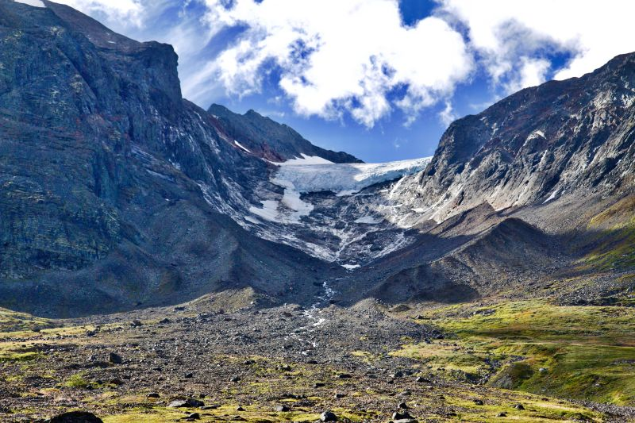

title: GIS data and digital maps for hiking in the mountains of Lapland in Northern Sweden (Kungsleden, Sarek and Padjelanta National Parks)
type: article
slug: gis-data-and-digital-maps-for-hiking-in-lapland
tags: [geo, gdal, hiking, kungsleden, sarek]
status: published
date: 2019-01-25

If you've ever done (or plan on doing) any hiking in the Arctic mountains of beautiful Lapland in Northern Sweden, you'll be familiar with the wonderful purple-colored Fjallkartan maps published by Lantmateriet. The hardcopy maps are essential when you're up there, but lately I've found myself wanting to have a digital version of these maps (and other data) as well. 

I have visited the area several times now and feel that digital maps would be helpful in planning trips, mapping tracks after getting back, as an extra layer in a GPS receiver, or even just for experimenting with in QGIS.

So, let's have a look at obtaining some digital copies of the Fjallkartan maps for Northern Sweden, and perhaps an elevation model and some satellite imagery would be nice too. I've included most of the steps and GDAL commands I've used, so if you're interested you should be able to reproduce these maps for other areas as well.

You can also skip down to the <a href="#">downloads</a> section if you're only interested in the data.

# Area of interest

The area I'm interested in is the mountain range in Northern Sweden, bordering Norway and surrounding the <a href="https://en.wikipedia.org/wiki/Kungsleden">Kungsleden Trail</a>, from Abisko in the North to the town of Hemavan in the South. The area includes several national parks (Abisko, Sarek, Padjelanta, Stora Sjofallets, Pieljekaise), trails (Kungsleden, Padjelanta) and peaks (Kebnekaise). The area is (depending on your definition) one of Europe's last remaining wildernesses, and the landscapes are absolutely stunning:

The photos were made by Anthony Arnold during our <a href="https://www.youtube.com/watch?v=_KiSp3mJEDk">hike from Nikkaluokta to Narvik</a> in the summer of 2016.

# Fjallkartan data

I was unable to find ready-made GeoTIFF versions of the maps on the Lantmateriet website (bit of a language barrier...) but their <a href="https://kso.etjanster.lantmateriet.se/oppnadata.html">open data site</a> lets you download sections of the maps as PNG images. While these seem like small extracts at first, you can download large sections at once by zooming out your browser with `CTRL-MINUS`, while keeping the map at the detail level that you want. With some cropping and copy-pasting I ended up with a huge image of around 7400 by 10000 pixels (some 236km by 320km) covering the entire region in sufficient detail:

A `gdal_translate` command can be used to convert the RGB bands of the PNG image into an optimized (compressed, tiled, etc) GeoTIFF file. The following command was used to create the final output map `kungsleden-topo.tif`, about 20Mb in size:

    :::console
    gdal_translate \
        -of GTiff \
        -b 1 -b 2 -b 3 \
        -a_srs EPSG:3006 \
        -a_ullr 458832 7610640 695952 7290640 \
        -co COMPRESS=JPEG \
        -co JPEG_QUALITY=90 \
        -co PHOTOMETRIC=YCBCR \
        -co TILED=YES \
        kungsleden_topo.png \
        kungsleden_topo.tif

<a href="#">Download full image as GeoTIFF (25Mb)</a>

The map is in the `SWEREF99 TM` spatial reference system, applied to the image using the `-a_srs EPSG:3006` option. I obtained the extents for the `-a_ullr` option manually by carefully looking up the coordinates of the edges of my original map image. The other creation options defined by `-co` are for optimization purposes. 

# Digital elevation model

The elevation data was obtained from the <a href="https://land.copernicus.eu/imagery-in-situ/eu-dem/eu-dem-v1.1/view">EU-DEM v1.1</a>. I'd like to mostly plot some elevation profiles of routes, so hopefully the EU-DEM is sufficiently detailed for that.

I needed the `E40N50` and `E40N40` tiles to cover the same extent as the Fjallkartan map above. Because I'd like all the datasets to have the same resolution and grid as the first one, we'll use GDAL again to merge and warp both tiles into the same coordinate system and extent as the above map. You have to download and extract the necessary tiles, and merge them together into a temporary VRT file with `gdalbuildvrt`:

    ::console
    gdalbuildvrt \
        temp.vrt \
        eu_dem_v11_E40N40/eu_dem_v11_E40N40.TIF \
        eu_dem_v11_E40N50/eu_dem_v11_E40N50.TIF

And then warp the VRT file into the desired output coordinate system and extent:

    ::console
    gdalwarp \
        -of GTiff \
        -ot Int16 \
        -overwrite \
        -t_srs EPSG:3006 \
        -te 458830 7290650 696048 7610650 \
        -ts 7400 10000 \
        -dstnodata -32768 \
        -co COMPRESS=DEFLATE \
        -co PREDICTOR=2 \
        -co ZLEVEL=1 \
        temp.vrt \
        kungsleden_dem.tif

Setting nodata values, compression, and a conversion from `Float32` to `Int16` data type are also included in the command. Our DEM is now looking good and matches the topo map created earlier:

<a href="#">Download full image as GeoTIFF (25Mb)</a>

# Satellite imagery

For the satellite imagery we will use the <a href="https://s2maps.eu/">Sentinel-2 cloudless</a> dataset produced by <a href="https://eox.at/">EOX</a> [1]. There's a few quick wins here: the data is available in GeoTIFF format straight from Amazon S3, it has global coverage, and the different tiling levels let you choose the resolution most suitable to your use case. 

There are various access methods, but I prefer direct access to the tiles via the `eox-s2maps` bucket on Amazon S3. This is a 'requestor pays' bucket, meaning that you have to set up your AWS account and pay for the data you transfer out of the bucket. I used a <a href="">small script</a> to download 612 tiles at zoom level 11, looking a bit like this for our area of interest:

So now we have 612 tiles of 512 by 512 pixels each in a `tiles` subdirectory. They look a bit squashed and distorted because the area is so far North, but we'll warp them to the same map extent as all our other maps of the region. Again in a two-step approach, first building a mosaic of all the tiles with `gdalbuildvrt`:

    ::console
    gdalbuildvrt \
        temp.vrt \
        tiles/*.tif

And then reprojecting everything with `gdalwarp` to our desired dimensions:

    ::console
    gdalwarp \
        -of GTiff \
        -overwrite \
        -t_srs EPSG:3006 \
        -te 458830 7290650 696048 7610650 \
        -ts 7400 10000 \
        -co COMPRESS=JPEG \
        -co JPEG_QUALITY=90 \
        -co TILED=YES \
        -wo INIT_DEST=255 \
        temp.vrt \
        kungsleden_sat.tif

This results in a nice satellite composite that matches up with our other datasets:

<a href="#">Download full image as GeoTIFF (25Mb)</a>

One issue that I encounted was that some of the glaciers are misrepresented as nodata in the tiles, perhaps due to their similarity to clouds, resulting in nodata pixels becoming black on the glaciers. This didn't look so good and was circumvented by setting `-wo INIT_DEST=255`, which initializes the new raster with values of 255, making all nodata pixels white instead.

I have also created a high resolution version (left) of the satellite map using source tiles at zoom level 13, which shows a bit more features than the low-res version (right):

<a href="#">Download full high resolution image GeoTIFF (25Mb)</a>

# Creating maps for a Garmin GPS receiver

I have a Garmin eTrex 30x GPS receiver which supports loading adding additional map layers as background maps. Unfortunately you can't just upload your geoferenced GeoTIFF to the device (that would be so straightforward it would just be silly... /s) so there are a couple of extra steps to it.

The gist of it is that a KML file needs to be created with one or more JPEG image overlays in it that contain your map image. The overlays can't be bigger than 1024x1024 pixels each without losing quality, and a maximum of 100 of these overlays are allowed for each map [4]. I'd like to figure out if this can be done with GDAL sometime, but for now I've found a nice Windows utility called <a href="https://moagu.com/?page_id=155">G-Raster</a> that streamlines this somewhat cumbersome process. The full version is needed for creating large maps with multiple overlays, and it costs a reasonable $5 that probably supports its creator.

# Creating cutouts from data on S3

Because the data are hosted publically on S3 as cloud optimized GeoTIFFs, it's easy to cut extracts from them using GDAL without having to download the whole file. For example, if you want to make a cutout of Sarek National Park for your next trip, just run the following command and GDAL will download and crop the relevant section from the file on S3:

# Downloads

I've hosted all the files on Amazon S3, so feel free to download them from there for your own use.

- Kungsleden Fjallkartan (7400x10000 GTiff, 23.5Mb)
- Kungsleden Digital Elevation Model (7400x10000 GTiff, 44.9Mb)
- Kungsleden Satellite (7400x10000 GTiff, 17.1Mb)
- Kungsleden Satellite High Res

The equivalent overlays for your Garmin device:

The extracts for Sarek National Park:

# Acknowledgements

Thanks to EOX for creating the Sentinel-2 cloudless dataset, and the European Space Agency (ESA) for their Copernicus programme and all the data it is generating. 

And a big thank you to Lantmateriet for making high quality maps that allow people to explore nature in a responsible manner.

<h2 class='notes-and-comments'>Disclaimer</h2>

While every attempt has been made to make the data as accurate as possible, I can't guarantee that it's actually any good for anything. I hope you find it useful for preparation and making some maps using your favourite GIS programme, and don't forget to check out the data sources yourself to ensure that they're fit for your intended purpose.

If you're actually venturing out into these areas, prepare yourself properly: bring official and up-to-date maps, know what you're getting yourself into, and most certainly don't rely on things with batteries and LCD screens to find the way there (or back) for you.

<h2 class='notes-and-comments'>Notes and comments</h2>

Thanks for reading! While there is no comment functionality on this website, I do appreciate any feedback, questions, improvements, and other ideas about this article. Feel free to contact me directly via e-mail at <a href="mailto:koko@geofolio.org">koko@geofolio.org</a>.

<h2 class='notes-and-comments'>References</h2>

[1] Sentinel-2 cloudless - <a href="https://s2maps.eu">https://s2maps.eu</a> by <a href="https://eox.at/">EOX IT Services GmbH</a> (Contains modified Copernicus Sentinel data 2016 & 2017)

[2] European Digital Elevation Model (EU-DEM), version 1.1 is available via <a href="https://land.copernicus.eu/imagery-in-situ/eu-dem/eu-dem-v1.1">https://land.copernicus.eu/imagery-in-situ/eu-dem/eu-dem-v1.1</a>

[3] Lantmateriet data available via <a href="https://opendata.lantmateriet.se/">https://opendata.lantmateriet.se/</a> and <a href="https://lantmateriet.se/">https://lantmateriet.se/</a>

[4] See <a href="https://forums.gpsfiledepot.com/index.php?topic=2832.0">this topic</a> on gpsfiledepot.com for more info on the Garmin map format.

