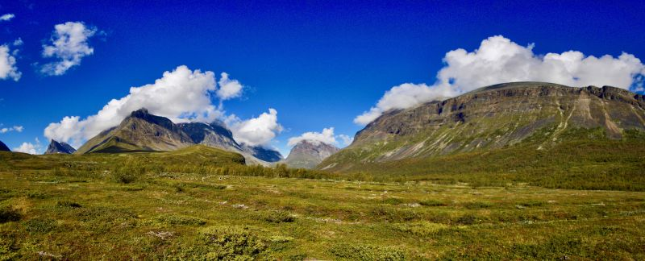
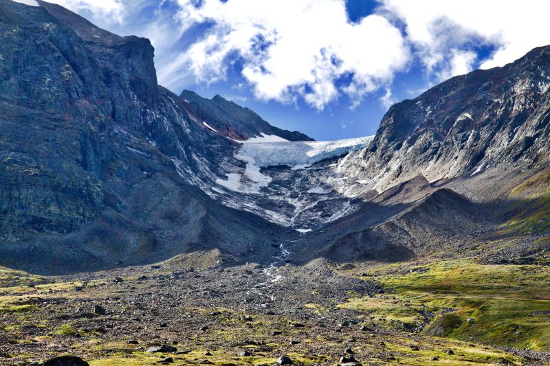

title: Some open GIS data for hiking in the mountains of Lapland in Sweden (Kungsleden Trail, Sarek National Park)
type: article
slug: open-gis-datasets-for-hiking-in-lapland
tags: [geo, hiking, gdal]
status: published
date: 2019-01-25

If you've ever done (or plan on doing) any hiking or trekking in the Arctic mountains and tundra of beautiful Lapland in Northern Sweden, you'll be familiar with the excellent purple-colored Fjallkartan maps published by Lantmateriet. The hardcopy maps are essential when you're up there, but lately I've found myself wanting to have a digital version of these (and other) maps as well. Mostly for planning purposes, QGIS experimentation, as an additional layer in my GPS device, and for mapping some tracks of a trip I'm planning this summer.

So, let's have a look at obtaining some digital copies of the Fjallkartan maps for the region, and perhaps an elevation model and some satellite imagery would be nice too.

# Area of interest

The area I'm interested in is the mountain range in Northern Sweden surrounding the <a href="https://en.wikipedia.org/wiki/Kungsleden">Kungsleden Trail</a>, from Abisko in the North to the town of Hemavan in the South. The area includes several national parks (Abisko, Sarek, Padjelanta, Stora Sjofallets, Pieljekaise), trails (Kungsleden, Padjelanta) and peaks (Kebnekaise). Just in case you're curious, as these photos from a trip in 2016 will attest, the area is absolutely stunning:

<small>Photo credits: My good friend Anthony Arnold, who was my trusty companion during this hike from Nikkaluokta to Narvik in 2016.</small>

# Fjallkartan data

The Fjallkartan maps are published under a Creative Commons (CC0) license. Unfortunately I was unable to find GeoTIFF versions of the maps on the Lantmateriet website, but luckily their <a href="https://kso.etjanster.lantmateriet.se/oppnadata.html">open data site</a> lets you download sections of the map as PNG images. While these seem like small extracts, you can download large sections (gotta be sneaky) at once by zooming out your browser while keeping the map at the required detail level. With some cropping and copy/pasting I ended up with a large PNG of around 6000 by 10000 pixels.

# Elevation model

# Satellite imagery

# Downloads

<h2 class='notes-and-comments'>Notes and comments</h2>

You can download the original image from the <a href="http://www.haagsebeeldbank.nl/afbeelding/41ff61b5-2304-4108-83f7-a42a6bb78d87">Municipal Archives (Gemeentearchief) of The Hague</a>.

Thanks for reading! While there is no comment functionality on this website, I do appreciate any feedback, questions, improvements, and other ideas about this article. Feel free to contact me directly via e-mail at <a href="mailto:koko@geofolio.org">koko@geofolio.org</a>.

