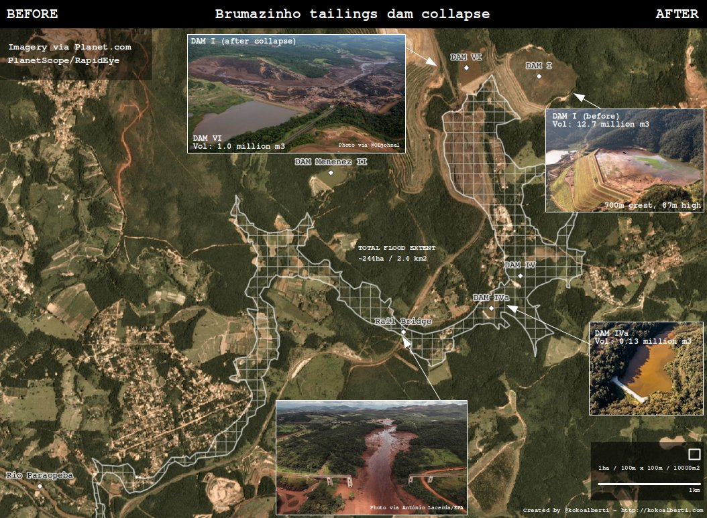
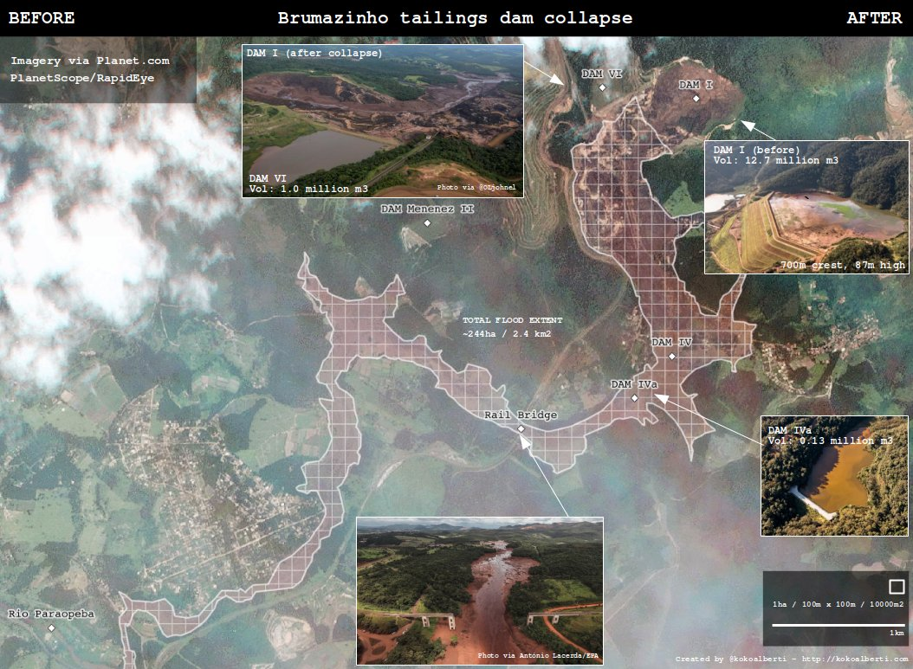

title: First look at Planet imagery of the Brumadinho (Brazil) dam collapse
description: First look at Planet imagery of the Brumadinho (Brazil) dam collapse
keywords: dam collapse brazil planet
type: article
slug: first-look-at-planet-imagery-brumadinho-dam-collapse
tags: [geo, planet, brumadinho, damcollapse]
status: published
date: 2019-01-27

This weekend news hit of a tailings dam collapse at a mine owned by Vale in Brumadinho, Brazil. From the initial reports and photos coming out of the area the damage looked immense. 

Because news reports were sparse on geospatial details that show the extent of the disaster, I started looking around for some data and put together this before/after visualization based on imagery by <a href="https://planet.com">Planet</a>.

The extent of the affected area looks to cover around 240 hectares (2.4sq.km), and the flood has destroyed large swaths of infrastructure in its path, including buildings, bridges, roads, and a smaller reservoir nestled in the valley downstream. Here are the before and after images:

</arcile>

<article>

You can download the <a href="brumadinho_damage_extent.zip">shapefile for the damage extent</a> here (7Kb). For access to the satellite imagery it is probably best to contact the people at <a href="https://planet.com">Planet</a> directly or sign up for their services.

There is also a <a href="https://www.slideshare.net/comcbhvelhas/barragens-de-mineracaovale">presentation from Vale</a> online with more details (photos, statistics, risk classifications) on this and other tailings dams in the surrounding area.

<link rel="stylesheet" href="https://cdn.knightlab.com/libs/juxtapose/latest/css/juxtapose.css">

<h2 class='notes-and-comments'>Updates</h2>

    28 Jan: Updated the images with some more details, added additional dams on the maps.

    28 Jan: Editing for less text, fix typo in image header, added presentation link.

<h2 class='notes-and-comments'>Notes and comments</h2>

Have a look at this article by Dave Petley on The Landslide Blog for more information and analysis: <a href="https://blogs.agu.org/landslideblog/2019/01/27/brumadinho-1/">https://blogs.agu.org/landslideblog/2019/01/27/brumadinho-1/</a>. For official communications from Vale see their <a href="http://www.vale.com/EN/aboutvale/reports/atualizacoes_brumadinho_home/Pages/default.aspx">press release</a> page.

The image of Dam 1 is from <a href="https://www.slideshare.net/comcbhvelhas/barragens-de-mineracaovale">this presentation</a> on SlideShare. The other images are by <a href="https://twitter.com/OLjohnel">John O'Leary</a> and by Antonio Lacerda via <a href="https://www.theguardian.com/world/2019/jan/26/hundreds-feared-dead-brazil-dam-collapse-releases-mud-tide">this article</a> in The Guardian.

Thanks for reading! While there is no comment functionality on this website, I do appreciate any feedback, questions, improvements, and other ideas about this article. Feel free to contact me directly via e-mail at <a href="mailto:koko@geofolio.org">koko@geofolio.org</a>.

