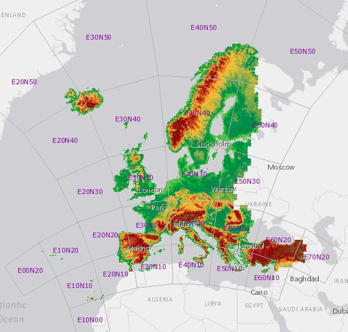
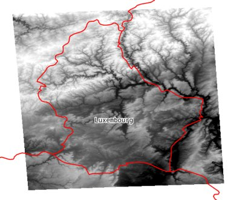
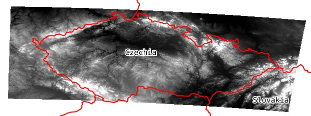
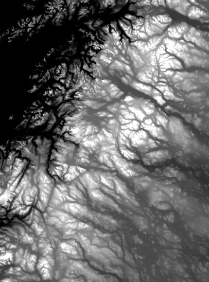

title: Hosting and accessing cloud optimized GeoTIFF files on AWS S3 - A practical guide using the EU-DEM elevation model
description: description
keywords: eudem eu-dem aws gdal geotiff cloud optimized s3
type: article
slug: hosting-and-accessing-cloud-optimized-geotiff-files-on-aws-s3
tags: [geo, eudem, aws, gdal, geotiff]
preview: preview.jpg
status: published
date: 2019-02-07

There are lots of great geospatial datasets available online, but accessing this data automatically and at scale is often difficult, and manual access usually takes a bit of work to download and sort it all. You'll have to register for some silly data portal, pick out the tiles that overlap your area of interest, and then extract only the bits you're interested in.

The <a href="https://land.copernicus.eu/imagery-in-situ/eu-dem/eu-dem-v1.1">European Digital Elevation Model</a> (EU-DEM) is one such example I encountered recently as part of a project I'm working on. The use case is that I would like to use GDAL in a task queue to automatically extract sections of the EU-DEM from different (user-defined) areas of interest all over Europe, and run some further analysis on the extracts. 

To tackle these kinds of cases I've become fond of using <a href="https://www.cogeo.org/">cloud-optimized GeoTIFF</a> files in combination with AWS Simple Storage Service (S3). Accessing the data can then be done on the fly using GDAL and its excellent <a href="https://www.gdal.org/gdal_virtual_file_systems.html">virtual file systems</a>.

This article explains how this works using the EU-DEM dataset as an example, but the approach is pretty similar for any type of large raster dataset. If you're just here for the data, this GDAL virtual file system path should satisfy your requirements: `/vsis3/geofolio-public/eu_dem_v11/eu_dem_v11.vrt`. But more on that later...

# Advantages

There are several advantages to hosting raster datasets using the cloud-optimized GeoTIFF/S3 tandem:

* Hosting data in 'Requester Pays' buckets allows you to make large amounts of raw data available to others (or yourself), but the person downloading it has to pay for the data transfer costs through their AWS account. This incentivizes making data available while reducing the risk of incurring high costs when someone decides to start accessing it in large quantities.
* There is no need to maintain/update/monitor any sort of geodata server to store the raster data. Just put it on S3, note down the URL somewhere, and basically never think about it again.
* AWS takes care of much of the performance/scaling/bandwidth issues. You can probably run a bunch of parallel requests from lots of different places (think AWS Lambda) without hitting any bottlenecks on the server end.
* Hosting some data on S3 is not super expensive. A 50Gb dataset like this EU-DEM will cost around $1.10/mo in the standard storage class, or $0.70/mo for infrequent access. Perhaps there are some other storage providers out there as well (as long as they support HTTP range requests on items in a bucket) that can compete on price.
* You can access data on the fly using the GDAL virtual file systems from pretty much anywhere. You're only limited by your own bandwidth, so this works great if your application is also hosted on AWS. Because the virtual file systems are well supported in GDAL you can use the data source seamlessly in all the GDAL command line tools.

# Downloading and preparing the EU-DEM dataset

## Download

The EU-DEM dataset is available from the <a href="https://land.copernicus.eu/">Copernicus Land Monitoring Service</a>. Of course they have a <a href="https://land.copernicus.eu/imagery-in-situ/eu-dem/eu-dem-v1.1">data portal</a> for which you have to register to be able to download files. After that it's possible to select the tiles you are interested in, and it will give you a download link for an archive with tiles. Each tile is some 4000 by 4000 pixels with a spatial resolution of 25m.

<small>Tiling scheme of EU-DEM dataset</small>

Because I like hoarding geodata I selected everything and the download file ended up being some 47Gb.

## Investigate the data

After extracting all the archives there were a total of 27 tiles. Lets have a look what we've got using `gdalinfo` on one of the tiles:

    :::console
    $ gdalinfo eu_dem_v11_E40N40.TIF
    Driver: GTiff/GeoTIFF
    Files: eu_dem_v11_E40N40.TIF
           eu_dem_v11_E40N40.TIF.ovr
           eu_dem_v11_E40N40.TIF.aux.xml
    Size is 40000, 40000
    Coordinate System is:
      (...)
    Origin = (4000000.000000000000000,5000000.000000000000000)
    Pixel Size = (25.000000000000000,-25.000000000000000)
    Metadata:
      AREA_OR_POINT=Area
      DataType=Elevation
    Image Structure Metadata:
      COMPRESSION=LZW
      INTERLEAVE=BAND
    Corner Coordinates:
      (...)
    Band 1 Block=128x128 Type=Float32, ColorInterp=Gray
      Description = Band_1
      Min=-24.630 Max=2427.487 
      Minimum=-24.630, Maximum=2427.487, Mean=442.836, StdDev=360.914
      NoData Value=-3.4028234663852886e+38
      Overviews: 20000x20000, 10000x10000, 5000x5000, 2500x2500, 1250x1250, 625x625, 
                 313x313, 157x157
      Metadata:
        (...)
    $

There are a couple of things here we might want to address before considering the files optimized and ready for hosting and access via S3:

* Make the overviews internal so they are no longer in a separate `.ovr` sidecar file. Instead of calculating them again we can use the `-co COPY_SRC_OVERVIEWS=YES` creation option to just copy them from the original dataset. The tiles are also quite large in size, and with added internal overviews our file size might also exceed 4Gb. To allow for this we can use the `-co BIGTIFF=YES` creation option.
* Increase the block size to 512 by 512 pixels. This is not a strict requirement, but doing so will decrease the number of HTTP range requests required to retrieve a certain area. Tiling is defined with `-co TILED=YES`,`-co BLOCKXSIZE=512` and `-co BLOCKYSIZE=512` creation options. Tile size doesn't matter that much (256 or 512 is advised), but it is absolutely crucial that image is tiled, otherwise accessing chunks of it over HTTP will be very inefficient.
* Have a critical look at the compression. Using LZW is fine, but using a floating point predictor can help to crunch the dataset even further in size. In a large dataset these tweaks can shave off a Gb here and there. Here we'll use `-co COMPRESS=LZW` and the floating point predictor with `-co PREDICTOR=2`. Refer to my <a href="/articles/geotiff-compression-optimization-guide/">GeoTIFF compression and optimization guide</a> for more information.
* I'm actually not sure of the necessity here to use `Float32` data type. It depends on the precision of the dataset. By switching to `Int16` we would use only half the bytes for each pixel, and `Int16` files generally also <a href="/articles/geotiff-compression-optimization-guide/">compress better</a>. Since I'm not sure what the makers of EU-DEM had in mind I'll leave the datatype as `Float32` for now.

## Optimizing the tiles

To implement the changes above, we can use a simple batch file to run a `gdal_translate` command against each of the EU-DEM tiles in our directory:

    :::bash
    #!/bin/bash
    mkdir -p optimized
    for file in *.TIF
    do
       gdal_translate "$file" "optimized/$file" \
         -co TILED=YES -co BLOCKXSIZE=512 -co BLOCKYSIZE=512 \
         -co COMPRESS=LZW -co PREDICTOR=2 \
         -co COPY_SRC_OVERVIEWS=YES -co BIGTIFF=YES
    done

Running this will create all the optimized files in the `optimized` subdirectory. There is also a utility in the GDAL sources called <a href= "https://raw.githubusercontent.com/OSGeo/gdal/master/gdal/swig/python/samples/validate_cloud_optimized_geotiff.py">`validate_cloud_optimized_geotiff.py`</a> which runs a few checks to verify that the GeoTIFF is indeed optimized. Running this on your original files will also give some hints as to what can be improved.

## Merging the tiles

There are now 27 tiles totalling 46Gb in size. These can be combined into a single virtual dataset with the `gdalbuildvrt` tool:

    :::console
    $ cd optimized
    $ gdalbuildvrt eu_dem_v11.vrt *.TIF

And the `eu_dem_v11.vrt` file can be used from now on to read data seamlessly from all the individual tiles.

## Sync everything to S3

We are ready to sync everything to an S3 bucket. I'm using my `geofolio-public` bucket, which has been created already and preconfigured as a 'Requester Pays' bucket. The AWS command-line interface (CLI) is used to sync the files to S3 and set the correct permissions:

    :::console
    $ aws s3 sync . s3://geofolio-public/eu_dem_v11 --acl public-read
    upload: ./eu_dem_v11.vrt to s3://geofolio-public/eu_dem_v11/eu_dem_v11.vrt           
    upload: ./eu_dem_v11_E00N20.TIF to s3://geofolio-public/eu_dem_v11/eu_dem_v11_E00N20.TIF
    (...)
    $

Then afterwards just to make sure they're actually there:

    :::console
    $ aws s3 ls s3://geofolio-public/eu_dem_v11/
    2019-02-05 15:21:57      13197 eu_dem_v11.vrt
    2019-02-05 15:21:57    3082221 eu_dem_v11_E00N20.TIF
    (...)
    2019-02-05 15:28:45  816689834 eu_dem_v11_E70N20.TIF
    $

## Other storage providers

While S3 works well for me because I do other things on AWS, there are many other storage providers out there for which a similar approach would work just as well. The only real requirement is that they allow HTTP range requests directly to the objects in the bucket. The GDAL `/vsicurl/` virtual file system can then be used (instead of `/vsis3/`) to access the data.

# Accessing the data

## Working with 'Requester Pays' buckets

Because the EU-DEM dataset is in a <a href="https://docs.aws.amazon.com/AmazonS3/latest/dev/RequesterPaysBuckets.html">'Requester Pays' bucket</a> you will need to authenticate with AWS in order to access data in the bucket. There are several ways to inform GDAL about your authentication details (refer to <a href="https://www.gdal.org/gdal_virtual_file_systems.html#gdal_virtual_file_systems_vsis3">this page for more info</a>), but for now we'll just add the credentials using  `--config` options defined as `--config <KEY> <VALUE>`. There are also ways to store these credentials in a file or as environment variables, but I won't get into that here.

The options you have to provide to use to use 'Requester Pays' buckets are your own `AWS_ACCESS_KEY_ID` and `AWS_SECRET_ACCESS_KEY`. Additionaly, the `AWS_REQUEST_PAYER` option needs to be set to `requester` to confirm to AWS that you're aware of the fact that your account will be charged for data transfer out of the bucket.

## Using the GDAL S3 virtual file system

The access pattern for the S3 virtual file system is `/vsis3/<bucket>/<key>`, so for our EU-DEM we can use `/vsis3/geofolio-public/eu_dem_v11/eu_dem_v11.vrt` as a valid data source (in combination with authenication details) in pretty much any GDAL command. 

As a test we're going to fetch a DEM of Luxembourg. First check with `gdalinfo` that we can access the dataset at all and that our authentication and connectivity is working:

    :::console
    gdalinfo /vsis3/geofolio-public/eu_dem_v11/eu_dem_v11.vrt \
        --config AWS_ACCESS_KEY_ID <your_key> \
        --config AWS_SECRET_ACCESS_KEY <your_secret> \
        --config AWS_REQUEST_PAYER requester

If you see the usual `gdalinfo` output listing metadata, extent, coordinate system, and a bunch of files also using the `/vsis3/` prefix, then everything should be working.

## A few examples

Now lets fetch our Luxembourg elevation model using `gdal_translate` with a bounding box specified with the `-projwin` and `-projwin_srs` options:

    :::console
    $ gdal_translate /vsis3/geofolio-public/eu_dem_v11/eu_dem_v11.vrt luxembourg.tif \
        -projwin_srs EPSG:4326 \
        -projwin 5.6 50.2 7.0 49.4 \
        -co COMPRESS=LZW \
        --config AWS_ACCESS_KEY_ID <your_key> \
        --config AWS_SECRET_ACCESS_KEY <your_secret> \
        --config AWS_REQUEST_PAYER requester
    Input file size is 282250, 216640
    0...10...20...30...40...50...60...70...80...90...100 - done.
    $

Which takes a couple of seconds and downloads an elevation model (2689 by 3707 pixels, 40Mb) of Luxembourg into `luxembourg.tif`:

Much larger areas such as all of the Czech Republic (22746 by 11279 pixels) are also possible, you're mostly limited by how long you want to wait for your download to complete:

It is also possible to use `gdalwarp` to download and reproject into a different coordinate system (in this case the Swedish `SWEREF99TM`):

    :::console
    gdalwarp \
        /vsis3/geofolio-public/eu_dem_v11/eu_dem_v11.vrt \
        sweden.tif \
        -t_srs EPSG:3006 \
        -te 458830 7290650 696048 7610650 \
        -ts 7400 10000 \
        --config AWS_ACCESS_KEY_ID <your_key> \
        --config AWS_SECRET_ACCESS_KEY <your_secret> \
        --config AWS_REQUEST_PAYER requester

Resulting in the following (7400 by 10000 pixels) file:

Well, you get the idea... the possibilities are endless!

<h2 class='notes-and-comments'>Notes and comments</h2>

EU-DEM v1.1 is produced using Copernicus data and information funded by the European Union.

I used a temporary EC2 instance for downloading the tiles, running GDAL commands, and syncing everything back to S3. For large datasets this is highly advisable and much faster than doing anything locally.

Thanks for reading! While there is no comment functionality on this website, I do appreciate any feedback, questions, improvements, and other ideas about this article. Feel free to contact me directly via e-mail at <a href="mailto:koko@geofolio.org">koko@geofolio.org</a>.

