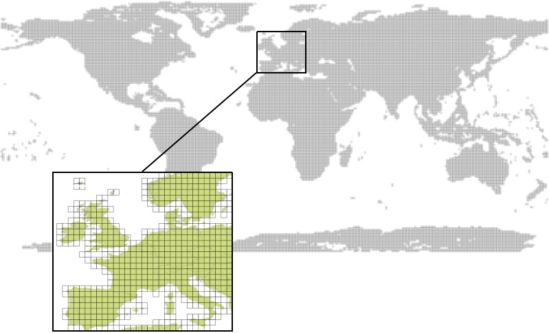
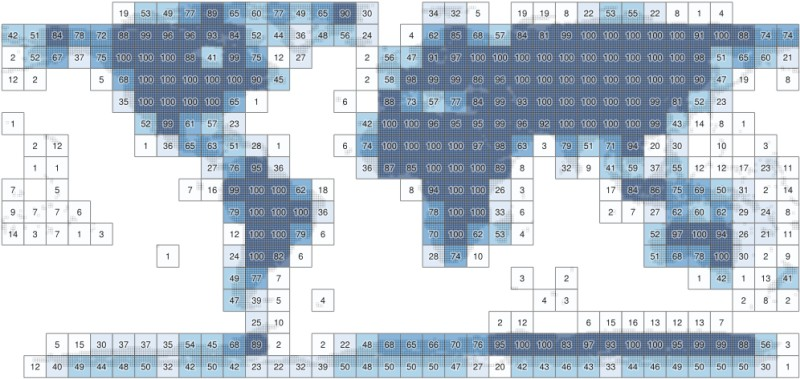
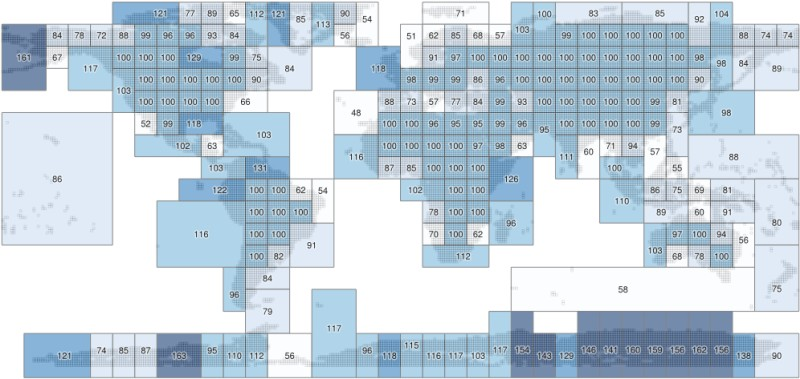
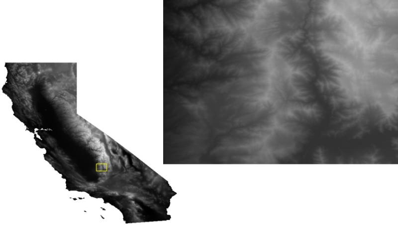

title: Experiments with the global JAXA ALOS World 30m elevation model on AWS S3
description: Experiments with the global JAXA ALOS World 30m elevation model on AWS S3
keywords: geotiff compression aws dem jaxa alos world 30m global
type: article
slug: experiments-with-the-global-jaxa-alos-world-30m-dem-on-aws-s3
tags: [geo, gdal, geotiff, compression, aws, dem]
status: published
date: 2019-05-21

So yesterday I was looking into a global 30m elevation model called the ALOS Global Digital Surface Model (AW3D30). It is from 2016 and produced by the Japanese Aerospace Exploration Agency (JAXA). Supposedly it is a pretty [decent dataset](https://www.int-arch-photogramm-remote-sens-spatial-inf-sci.net/XLI-B4/149/2016/isprs-archives-XLI-B4-149-2016.pdf), even though a quick inspection still found quite a few nodata gaps here and there. Like the SRTM 30m and ASTER GDEM it has some good things going for it: near-global coverage, a decent resolution, and it is freely available.

## TL;DR

Using "this one weird GDAL creation option" `-co PREDICTOR=2` shaves 325Gb off the ALOS World global 30m elevation model. Data available in requester pays S3 bucket via GDAL virtual file system at `/vsis3/geofolio-public/jaxa_alos_world_30m/jaxa_alos_world_30m.vrt`.

## Data access

I wanted to use it (the whole thing, because my areas of interest are user-defined) in a project I'm working on so I started looking for an accessible cloud optimized version, preferably on a platform like AWS where my data can live close to my application.

Accessing data via JAXA is possible, but it does not really support efficient access methods like GDAL's [virtual file systems](https://www.gdal.org/gdal_virtual_file_systems.html). You can access the gzipped tar tiles though via this [retro data portal](https://www.eorc.jaxa.jp/ALOS/en/aw3d30/index.htm) or via [anonymous FTP](ftp://ftp.eorc.jaxa.jp//pub/ALOS/ext1/AW3D30/release_v1903/).

A more modern alternative is via the data portal at [opentopography.org](http://opentopo.sdsc.edu/raster?opentopoID=OTALOS.112016.4326.2), who offer a webservice hosting all 22126 one-by-one degree geotiff tiles at [https://cloud.sdsc.edu/v1/AUTH_opentopography/Raster/AW3D30_E/](https://cloud.sdsc.edu/v1/AUTH_opentopography/Raster/AW3D30_E/). 

## This one weird trick in GDAL

Upon closer inspection I had a a couple of issues with the data hosted via opentopography.org:

* The virtual dataset [`AW3D30_E_alos.vrt`](https://cloud.sdsc.edu/v1/AUTH_opentopography/Raster/AW3D30_E/AW3D30_E_alos.vrt) which can be used as an access point for GDAL's `/vsicurl/` virtual file system contains all 22126 GTiff tiles, making it around 10Mb in size. Not ideal to have to transfer that for every request, no matter how big or small.
* The entire dataset is 456Gb in size, not catastrophically huge but still quite large.
* The tiles do not have tiling enabled, making transfers of small areas inefficient.
* The tiles were not compressed using a floating point predictor in their compression settings, making both the file size and transfer size unnecessarily large.

For example, lets have a look at a this random tile [`N046E029_AVE_DSM_wgs84.tif`](https://cloud.sdsc.edu/v1/AUTH_opentopography/Raster/AW3D30_E/AW3D30_E_alos/North/North_46_90/N046E029_AVE_DSM_wgs84.tif), which is 37Mb in size:

    :::console
    $ gdalinfo N046E029_AVE_DSM_wgs84.tif 
    Driver: GTiff/GeoTIFF
    Files: N046E029_AVE_DSM_wgs84.tif
    Size is 3600, 3600
    (...)
    Metadata:
      AREA_OR_POINT=Area
    Image Structure Metadata:
      COMPRESSION=DEFLATE
      INTERLEAVE=BAND
    Corner Coordinates:
    (...)
    Band 1 Block=3600x1 Type=Float32, ColorInterp=Gray
      NoData Value=-9999
    $ ls -sh N046E029_AVE_DSM_wgs84.tif 
    37M N046E029_AVE_DSM_wgs84.tif
    $

So the lack of tiling is not ideal. Moving on, uncompressed the file is around 50Mb:

    :::console
    $ gdal_translate -q N046E029_AVE_DSM_wgs84.tif uncompressed.tif
    $ ls -sh uncompressed.tif 
    50M uncompressed.tif

Lets have a look at some compression options. Since this is a `Float32` dataset a `-co PREDICTOR=2` should have really been used while creating it:

    :::console
    $ gdal_translate -q N046E029_AVE_DSM_wgs84.tif deflate-predictor-2.tif \
        -co COMPRESS=DEFLATE \
        -co PREDICTOR=2
    $ ls -sh deflate-predictor-2.tif 
    12M deflate-predictor-2.tif

Apparently not.

With a simple `-co PREDICTOR=2` creation option the tile is shrunk from 37Mb to only 12Mb, about a third of the original compressed size! And there are more than twenty thousand tiles in this 470Gb dataset!

This is why you think carefully about [compressing and optimizing your GeoTIFF files](/articles/geotiff-compression-optimization-guide/).

One more quick test to see if there is a difference between LZW or Deflate compression ratio and processing time. For a fast Deflate with `-co COMPRESS=DEFLATE` and `-co ZLEVEL=1`:

    :::console
    $ time gdal_translate -q N046E029_AVE_DSM_wgs84.tif deflate.tif \
        -co COMPRESS=DEFLATE \
        -co PREDICTOR=2 \
        -co ZLEVEL=1 \
        -co TILED=YES

    real    0m1.064s
    user    0m0.960s
    sys 0m0.096s
    $ ls -sh deflate.tif
    13M deflate.tif
    $

And LZW with `-co COMPRESS=LZW`:

    $ time gdal_translate -q N046E029_AVE_DSM_wgs84.tif lzw.tif \
        -co COMPRESS=LZW \
        -co PREDICTOR=2 \
        -co TILED=YES

    real    0m0.969s
    user    0m0.852s
    sys 0m0.109s
    $ ls -sh lzw.tif
    11M lzw.tif
    $

So LZW is slightly faster and compresses a bit better too.

## Optimizing the tiles

Let's optimize these tiles, thereby adding tiling and crunching the dataset to a more managable size, and upload everything to our own S3 bucket so we can play with it until the end of time (or the end of Amazon, whichever comes first...)

I loaded up a temporary `i3.2xlarge` instance and made a list with URLs of all the GTiff tiles in `filelist.txt`, and downloaded the entire dataset using into a temporary directory `/data/original` using [`aria2c`](https://aria2.github.io/) parallel download utility:

    :::console
    $ cd /data
    $ mkdir original
    $ cd original && aria2c -x4 -i ../filelist.txt
    (...)
    Status Legend:
    (OK):download completed.
    $

Now we have 22126 tiles, adding up to a grand total of 476Gb:

    :::console
    $ du -hs /data/original && ls -l /data/original | wc -l
    476G    /data/original
    22126

We optimize them using a small shell script `optimize.sh`:

    ::::bash
    #!/bin/bash
    # Loop over the files. Run the script from the directory
    # with all the original files in it. All paths are relative
    # from there.
    for file in *.tif
    do
        if [ ! -f ../tiles/$file ]; then
            # Create the tile if doesn't exist yet in the tiles 
            # subdirectory. This lets us start/stop the program
            # without having to keep track of where we are.
            echo $file
            # Run the gdal_translate command we figured out 
            # before
            gdal_translate -q "$file" "../tiles/$file" \
                -co NUM_THREADS=ALL_CPUS \
                -co TILED=YES \
                -co COMPRESS=LZW \
                -co PREDICTOR=2 
        fi
    done

Run it as:

    ::::console
    $ cd /data/original && ../optimize.sh
    (...)

This takes a while, when it is complete we can compare the two versions:

    ::::console
    $ du -hs /data/original /data/tiles
    476G    /data/original
    151G    /data/tiles

And that's now using a predictor can shave 325Gb off your dataset.

## Making a tile index

The other issue to tackle is that the virtual dataset index file is around 10Mb in size and contains references to 22126 separate tiles. Having one is quite essential, as it will allow us to access the entire dataset from anywhere using a single URL endpoint of the VRT index.

There is no obvious solution for this, as VRT files don't support a proper spatial index. However, we can actually make an improvised index by including a VRT inside another VRT. We'll split the 22126 GTiff tiles into separate VRT files containing around 100 tiles each, giving us around 200 of these VRT index datasets. 

Then we include all these VRT tiles in a new master VRT file, and GDAL will sort everything out for us when we request data from the URL endpoint of this master file.

Lets have a quick look at what the coverage looks like and how best to split up 22126 tiles:

That's a lot of tiles. By overlaying a simple 10-by-10 degree grid over the tile footprints in QGIS we can create a rudimentary index, resulting in a maximum of 100 tiles in each subdivision:

Now there are a total of 406 subdivisions, but they're not balanced very well because are a lot of divisions with only a few tiles in them. Several minutes with QGIS and the "Merge Selected Features" command and "Bounding Boxes" in the processing toolbox yields 231 subdivisions, resulting in an index with a better balance:

It's still not perfect, and there are other ways to automate this, but for now it's probably fine, I didn't want to spend too much time on it.

I used a Python script to create VRT files out of each of these subdivisions (this was a bit of manual work, couldn't think of another quick solution for it), resulting in 231 VRT index files:

    ::::console
    $ ls *.vrt
    tile-001.txt.vrt
    (...)
    tile-213.txt.vrt
    $

All of these are then added to the final index using `gdalbuildvrt`:

    ::::console
    $ gdalbuildvrt jaxa_alos_world_30m.vrt *.vrt
    $ ls -sh jaxa_alos_world_30m.vrt
    104K jaxa_alos_world_30m.vrt

The master index file is now 104Kb, and the VRT files for the subdivisions are around 40Kb each, so we'll have to load only around 150Kb of index data for each request, down from about 10Mb.

## Syncing to S3

Syncing the optimized dataset to my `geofolio-public` S3 bucket is simple with the AWS command line tools:

    ::::console
    $ aws s3 sync . s3://geofolio-public/jaxa_alos_world_30m/ \
        --storage-class STANDARD_IA \
        --acl public-read \
        --exclude "*" \
        --include "tiles/*.tif" \
        --include "*.vrt"
    (...)
    $

Which makes the dataset available in my Requester Pays bucket at `s3://geofolio-public/jaxa_alos_world_30m/jaxa_alos_world_30m.vrt`.

## Accessing the data

Due to the fact that I like my AWS bill to not be huge, the `geofolio-public` bucket is a "Requester Pays" bucket. This means the data in the bucket is publically available, but you (instead of me) have to pay for the data transfer fees out of the bucket through your AWS account. It's not huge but for big datasets it can add up. See my [other article](/articles/hosting-and-accessing-cloud-optimized-geotiff-files-on-aws-s3/) and the [GDAL Documentation](https://www.gdal.org/gdal_virtual_file_systems.html#gdal_virtual_file_systems_vsis3) for how this works in detail.

To make sure everything works as intended lets download a 30m DEM for of California, which may take a while because California is rather large:

    ::::
    $ gdalwarp \
        -overwrite \
        --config AWS_REQUEST_PAYER requester \
        -cutline california.shp \
        -crop_to_cutline \
        -multi \
        -co COMPRESS=LZW -co PREDICTOR=2 -co NUM_THREADS=ALL_CPUS \
        /vsis3/geofolio-public/jaxa_alos_world_30m/jaxa_alos_world_30m.vrt \
        california.tif
    (...)
    $ ls -sh california.tif
    792M california.tif
    $ gdalinfo california.tif
    Driver: GTiff/GeoTIFF
    Files: california.tif
    Size is 37044, 34083
    (...)
    $

<h2 class='notes-and-comments'>Afterword on direct writing using <tt>/vsis3/</tt></h2>

After going through this exercise it occurred to me that it might also be possible to use GDAL <tt>/vsicurl/</tt> to read directly from the source, and write the optimized tile directly to its final S3 destination using <tt>/vsis3/</tt>, without any intermediary step or needing large amounts of scratch space. 

This did not work however. The <tt>/vsis3/</tt> <a href="https://www.gdal.org/gdal_virtual_file_systems.html#gdal_virtual_file_systems_vsis3">documentation</a> offers an explanation: only sequential writing is possible, "so in particular direct writing of GeoTIFF files with the GTiff driver is not supported". If anyone knows a way around this I'd be curious, so let me know.

<h2 class='notes-and-comments'>Notes and comments</h2>

Thanks for reading! While there is no comment functionality on this website, I do appreciate any feedback, questions, improvements, and other ideas about this article. Feel free to contact me directly via e-mail at <a href="mailto:koko@geofolio.org">koko@geofolio.org</a>.

<h2 class='notes-and-comments'>Special thanks</h2>

Special thanks to opentopography.org for making this dataset (and all the other ones they have) available through their excellent service.

<h2 class='notes-and-comments'>References and attribution</h2>

J. Takaku, T. Tadono, K. Tsutsui: <a href="http://www.int-arch-photogramm-remote-sens-spatial-inf-sci.net/XL-4/243/2014/isprsarchives-XL-4-243-2014.pdf">Generation of High Resolution Global DSM from ALOS PRISM</a>, The International Archives of the Photogrammetry, Remote Sensing and Spatial Information Sciences, pp.243-248, Vol. XL-4, ISPRS TC IV Symposium, Suzhou, China, 2014.

T. Tadono, H. Ishida, F. Oda, S. Naito, K. Minakawa, H. Iwamoto : Precise Global DEM Generation By ALOS PRISM, ISPRS Annals of the Photogrammetry, Remote Sensing and Spatial Information Sciences, pp.71-76, Vol.II-4, 2014. https://doi.org/10.5069/G94M92HB

This work is based on services provided by the <a href="https://opentopography.org">OpenTopography Facility</a> with support from the National Science Foundation under NSF Award Numbers 1557484, 1557319, and 1557330.

