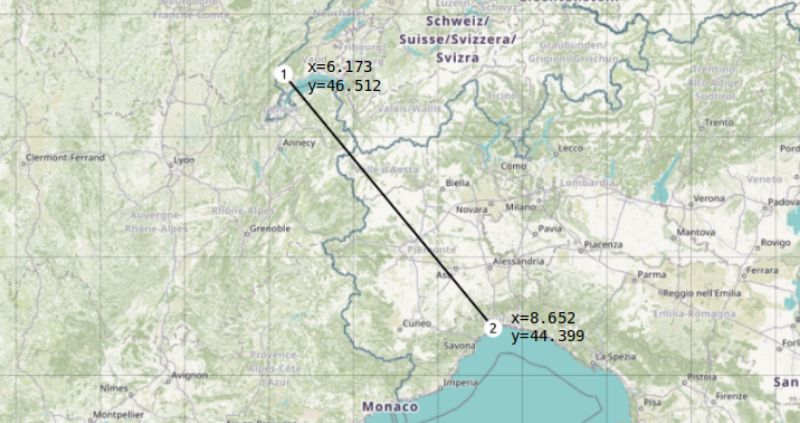
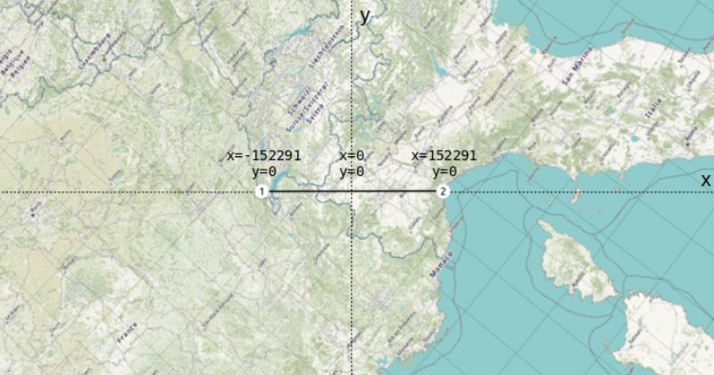
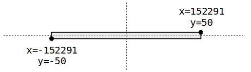
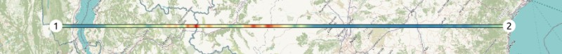
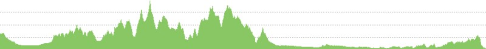
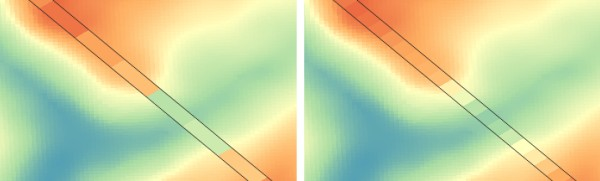

title: "Creating elevation profiles and other raster cross-sections using GDAL and the two-point equidistant projection"
description: "Creating elevation profiles and other raster cross-sections using GDAL and the two-point equidistant projection"
keywords: geo elevation profile two point equidistant gdal
type: article
slug: creating-elevation-profiles-with-gdal-and-two-point-equidistant-projection
tags: [geo, gdal, elevation, profile, tpeqd]
status: published
date: 2019-09-26

Recently I was looking into making some elevation profiles and other types of cross-sections of GeoTIFF files hosted in the cloud. The idea was rather simple, draw a line on a web map and then an elevation profile (or some other thematic cross section about land use, soils, NDVI, etc) would be returned by an AWS Lambda function along the selected profile. Then line these results up in a chart and you'll have a neat visualization. 

While thinking about this, the whole thing started to become a bit complicated: how many samples to take along the profile, how to interpolate/resample (or not) when your profile is at 100m resolution and your elevation model at 30m, can we do this with just GDAL or do we need Shapely to calculate points on the line, can we just make any line or is a great circle better, and also how do we bundle queries for pixel values into as few network requests as possible? And what about using overviews that are present in larger datasets?

This point is usually when you sit back and think for a second whether there is not a simpler solution. 

Idea: Maybe it is possible to define the requested profile as a reaaaaally long thin map in a different (but freely rotatable) coordinate system, then just warp the source data into it and let poor GDAL deal with all the complicated stuff...

# Enter Two-Point Equidistant Projection

The [two-point equidistant projection](https://proj.org/operations/projections/tpeqd.html) allows you to define a simple map projection based on two points on Earth. In this case, we can conveniently use the start and end points of the profile line we want to make. 

Let's be a little ambitious make an elevation profile from Lake Geneva in Switzerland, then go some 300km across the Alps to the Mediterranean coast near Genoa in Italy:

We can define a two-point equidistant projection based on these two points using `+proj=tpeqd` in the following Proj string:

    +proj=tpeqd +lon_1=6.173 +lat_1=46.512 +lon_2=8.652 +lat_2=44.399

A quick preview of this custom projection in QGIS (Settings - Custom Projections) shows that everything is warped so that the projection center is now halfway between Point 1 and Point 2, and both of our profile endpoints are nicely on the x-axis at `y=0`.

Because we can't warp things into a line we'll actually turn the line into a thin rectangle, which in this case is so thin that it looks a bit like a tiny satellite swath. For now we'll take a width of 100 meters, so the extent of our swath becomes (image not to scale):

# Warping Data Into The Swath

At this point we can start warping data into our swath extent using `gdalwarp`. We will use the EU-DEM located at `/vsis3/geofolio-public/eu_dem_v11/eu_dem_v11.vrt` as our data source. These files are in a "Requester Pays" bucket, so you'll need an AWS account and to configure some settings if you want to use it as well. [See my other article for more info on the EU-DEM dataset](/articles/hosting-and-accessing-cloud-optimized-geotiff-files-on-aws-s3/) and how to set up access to "Requester Pays" buckets. Any other GDAL data source should also work fine.

Here is the `gdalwarp` command to make a 1-by-3000 pixel `profile.tif` containing the information we need:

    gdalwarp /vsis3/geofolio-public/eu_dem_v11/eu_dem_v11.vrt profile.tif \
        -overwrite \
        -te -152291.47, -50.0, 152291.47, 50.0 \
        -t_srs "+proj=tpeqd +lon_1=6.173 +lat_1=46.512 +lon_2=8.652 +lat_2=44.399" \
        -ts 3000 1 \
        -r near

And we'll get a `profile.tif` spanning our 300km profile at 100m resolution (swath width exaggerated here, it's actually 1 pixel high but you can't see that on the map):

As well as a quick image of the profile with around 3000 points that we've been interested in all along:

The profile data values can be extracted by reading the data from the output TIF file, for example using Python and the GDAL bindings:

    :::python
    from osgeo import gdal

    ds = gdal.Open('profile.tif')
    data = ds.GetRasterBand(1).ReadAsArray()

    # 'data' is a (1, 3000) numpy array with our profile values:
    # [[1397.099 1360.8303 1339.6602 ... 76.00187 96.683014 131.35663 ]]

# Warp Options 

There are a few warp options to keep in mind as well to help in customizing and tweaking how the profile is made. The warp options are important as they let you configure the specifics of how the source pixels under the swath are to be converted to the pixel values of the transect.

## Output file size `-ts`

The `-ts <width> <height>` argument is needed to force the output profile to be only a single pixel in height. You can experiment further with the `width` to change the resolution of the profile. For example, setting `-ts 1000 1` (left image) as opposed to `-ts 3000 1` (right image) will make a profile only 1000 samples:

## Resampling method `-r`

The resampling method defined by the `-r` argument is also important. Using `-r near` uses nearest neighbour, which just picks whatever pixel in the original data that happens to be closest to the center of the pixel in our warped profile. This is not always representative for the rest of the contributing pixels. Alternatively, consider using `-r average`, which will compute the average of all non-NODATA contributing pixels. This might take a bit longer and will have to query more pixel values, but the result is much more accurate and representative.

For datasets with categorical data such as a landuse map with a particular value for each class, you can use mode resampling with `-r mode`. This assigns the value occurring most often in the input dataset to your output profile.

## Overviews `-ovr`

When querying datasets that have overviews enabled (lots of cloud-optimized GTiffs have this) you should also be aware of the `-ovr` argument. This lets you specify a specific overview level to query with `-ovr <level>`, or disable querying overviews altogether with `-ovr NONE`. GDAL uses sensible defaults here as well, so omitting it will have GDAL pick the most sensible overview level for the output resolution it needs to make.

As always, refer to the [gdalwarp documentation](https://gdal.org/programs/gdalwarp.html) for more information about these options.

# Extracting Data

I made a small Python utility program called [`mkprofile.py`](https://github.com/kokoalberti/geocmd/blob/master/mkprofile/mkprofile.py) that does all of the above from the command line, letting you customize things like swath width and resampling methods, and writes the output to a CSV file. 

It's not a very fancy tool, but do check out the source if you'd like to make profiles using the GDAL Python bindings instead of the command line tools, there are some more examples in there for running `gdalwarp` from the Python bindings and how to convert the coordinates to a `tpeqd` projection using the Proj library.

Run it as `mkprofile.py SRC LON_1 LAT_1 LON_2 LAT_2`. For example:

    :::console
    $ ./mkprofile.py \ 
        /vsis3/geofolio-public/eu_dem_v11/eu_dem_v11.vrt \
        6.173 46.512 8.652 44.399 \
        --csv profile.csv
    Reading and warping data into profile swath...
    Created 245800m profile with 2458 samples.
    Saved as profile.csv
    $ head -10 profile.csv 
    dist,value
    0,1406.091552734375
    100,1379.4495849609375
    200,1365.6845703125
    300,1343.8507080078125
    400,1333.7431640625
    500,1322.367919921875
    600,1314.52978515625
    700,1309.57275390625
    800,1302.2603759765625
    $

The web interface which was the reason for diving into this is still a work in progress, so this is it for now. 

%%THANKS%%
